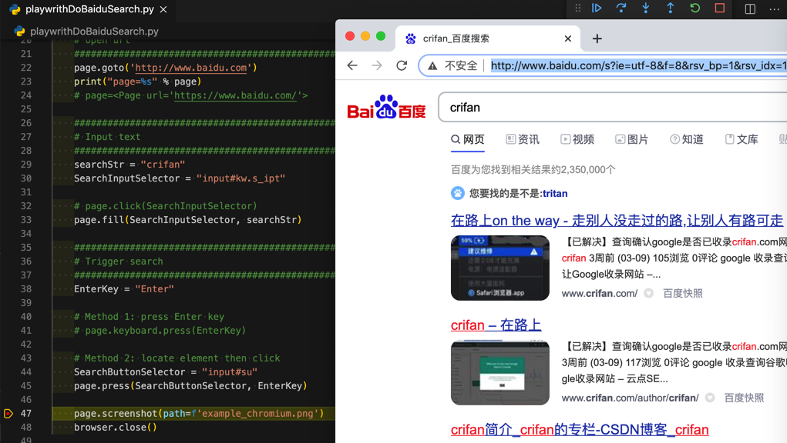

# 模拟按键

举例：进入百度主页，已输入了文字，想要触发搜索，有2种方式：

* 全局直接输入`回车键`
    ```python
    EnterKey = "Enter"
    # Method 1: press Enter key
    page.keyboard.press(EnterKey)
    ```
* 定位到`百度一下`按钮，再按`回车键`
    ```python
    EnterKey = "Enter"
    # Method 2: locate element then click
    SearchButtonSelector = "input#su"
    page.press(SearchButtonSelector, EnterKey)
    ```

注：估计定位到按钮后，再click点击，也是可以的。有空再深究。

效果：触发了百度搜索后，显示出搜索结果


