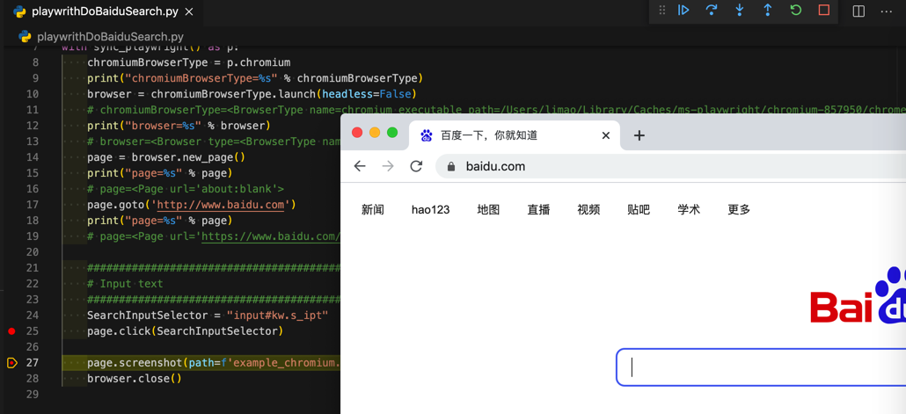

# 查找并点击元素

对于百度主页搜索输入框，html是：

```html
<input id="kw" name="wd" class="s_ipt" value="" maxlength="255" autocomplete="off">
```

查找到该元素，并且点击该元素，的代码：

```python
  SearchInputSelector = "input#kw.s_ipt"
  page.click(SearchInputSelector)
```

效果：点击了百度的输入框后的效果：


