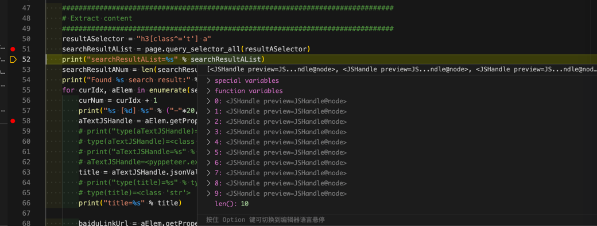
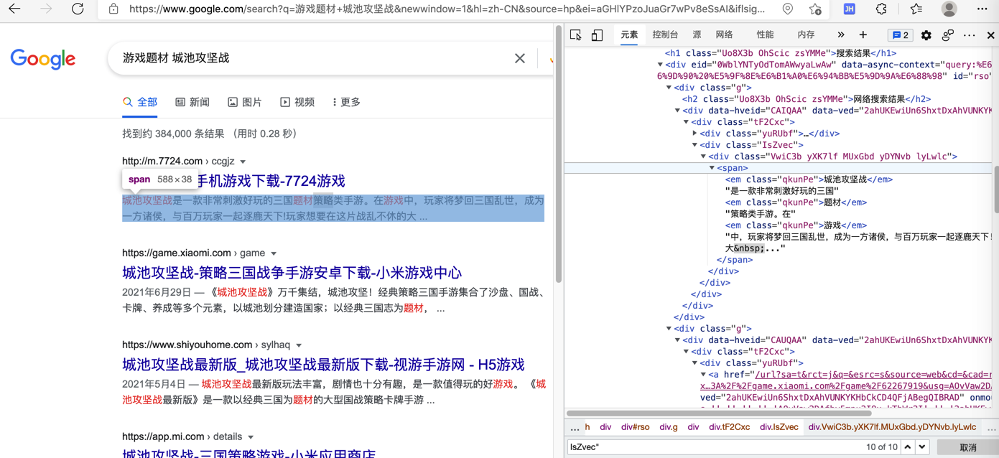
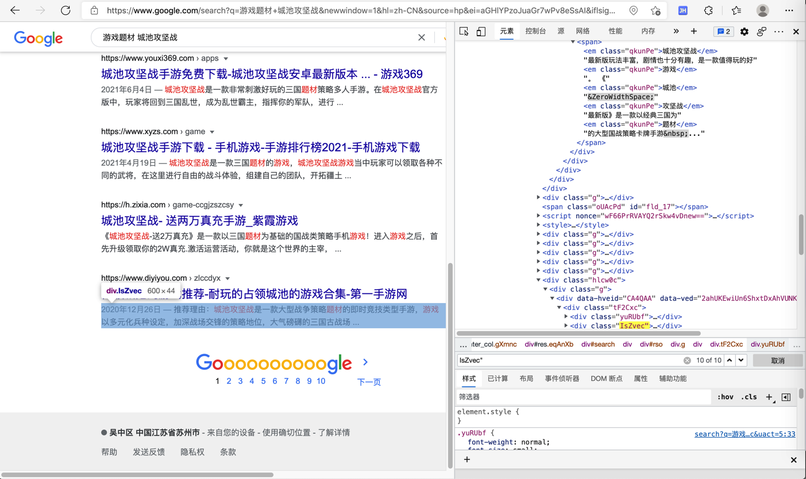

# 查找元素

从页面中`寻找`=`定位`=`获取`元素的函数是：

* element_handle
  * `element_handle.query_selector(selector)`
    * https://playwright.dev/python/docs/api/class-elementhandle#element_handlequery_selectorselector
  * `element_handle.query_selector_all(selector)`
    * https://playwright.dev/python/docs/api/class-elementhandle#element_handlequery_selector_allselector
* page
  * `page.query_selector(selector)`
    * https://playwright.dev/python/docs/api/class-page#pagequery_selectorselector
  * `page.query_selector_all(selector)`
    * https://playwright.dev/python/docs/api/class-page#pagequery_selector_allselector
      * 注：返回的是`JSHandle`的`list`

## 举例

### 百度搜索结果中的标题部分

```python
    resultASelector = "h3[class^='t'] a"
    searchResultAList = page.query_selector_all(resultASelector)
    print("searchResultAList=%s" % searchResultAList)
```

输出：

```bash
searchResultAList=[<JSHandle preview=JSHandle@<a target="_blank" href="http://www.baidu.com/link?…>在路上on the way - 走别人没走过的路,让别人有路可走</a>>, <JSHandle preview=JSHandle@node>, <JSHandle preview=JSHandle@node>, <JSHandle preview=JSHandle@node>, <JSHandle preview=JSHandle@node>, <JSHandle preview=JSHandle@node>, <JSHandle preview=JSHandle@node>, <JSHandle preview=JSHandle@node>, <JSHandle preview=JSHandle@node>, <JSHandle preview=JSHandle@node>]
```



### 查找定位google搜索结果

背景：

对于playwright来说，html元素选择，即支持xpath，也支持css selector。

此处对于google搜索结果的定位：

html代码：

```html
<div class="IsZvec">
    <div class="VwiC3b yXK7lf MUxGbd yDYNvb lyLwlc"><span><em class="qkunPe">城池攻坚战</em>是一款非常刺激好玩的三国<em
                class="qkunPe">题材</em>策略类手游。在<em
                class="qkunPe">游戏</em>中，玩家将梦回三国乱世，成为一方诸侯，与百万玩家一起逐鹿天下!玩家想要在这片战乱不休的大&nbsp;...</span></div>
</div>
。。。
                <div class="IsZvec">
                    <div class="VwiC3b yXK7lf MUxGbd yDYNvb lyLwlc"><span class="MUxGbd wuQ4Ob WZ8Tjf">2020年12月26日 —
                        </span><span>推荐理由：<em class="qkunPe">城池攻坚战</em>是一款大型战争策略<em class="qkunPe">题材</em>的即时竞技类型手游，<em
                                class="qkunPe">游戏</em>以多元化兵种设定，加深战场交锋的策略地位，大气磅礴的三国古战场&nbsp;...</span></div>
                </div>
。。。
```

`div class=IsZvec`后面的`div`中：

* 第一个是只有一个`span`，是描述文字
* 之后每个都是2个`span`，前一个=第一个，是日期；后一个=最后一个，才是描述文字

#### 定位第一个结果

第一个结果中，div下，只有一个span，是描述内容



对应定位元素的`css selector`的写法：

```css
div[class='g'] div[class='IsZvec'] div span:first-child
```

#### 定位最后一个结果

页面：



想要定位到，最后一个的span，具体语法是：

```css
div[class='g'] div[class='IsZvec'] div span:last-child
```

相关代码：

```python
searchResultSelector = "div[class='g'] div[class='IsZvec'] div span:last-child”
searchResultList = page.query_selector_all(searchResultSelector)
```

相关完整代码：

```python
    searchResultSelector = "div[class='g'] div[class='IsZvec'] div span:last-child"
    # searchResultSelector = "div[class='g'] div[class='IsZvec'] div span:first-child"
    searchResultList = page.query_selector_all(searchResultSelector)
    print("searchResultList=%s" % searchResultList)
    searchResultNum = len(searchResultList)
    print("Found %s search result:" % searchResultNum)
    for curIdx, spanElem in enumerate(searchResultList):
        curNum = curIdx + 1
        print("%s [%d] %s" % ("-"*20, curNum, "-"*20))
        print("spanElem=%s" % spanElem)
        title = spanElem.text_content()
        print("title=%s" % title)
        # title=城池攻坚战是一款非常刺激好玩的三国题材策略类手游。在游戏中，玩家将梦回三国乱世，成为一方诸侯，与百万玩家一起逐鹿天下!玩家想要在这片战乱不休的大 ...
```
