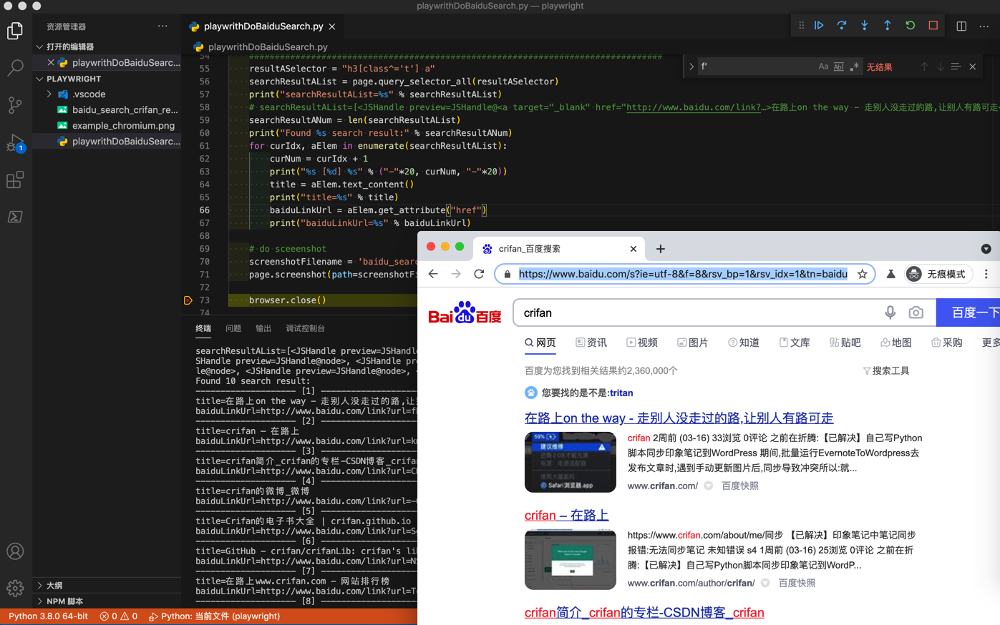

# 获取元素属性值

在找到元素后，获取属性值，可以用：

* `text_content()`：获取文本值
  * 文档：[element_handle.text_content()](https://playwright.dev/python/docs/api/class-elementhandle#element_handletext_content)
* `get_attribute("attribute_name")`：获取属性值
  * 文档：[element_handle.get_attribute(name)](https://playwright.dev/python/docs/api/class-elementhandle#element_handleget_attributename)
  * 举例：
    * `get_attribute("href")`
* `inner_html()`：获取html值
  * 文档：[element_handle.inner_html()](https://playwright.dev/python/docs/api/class-elementhandle#element_handleinner_html)
* `inner_text()`：获取内部文本值
  * 文档：[element_handle.inner_text()](https://playwright.dev/python/docs/api/class-elementhandle#element_handleinner_text)

## 举例

从百度搜索后的结果，解析提取每个结果的标题和链接的代码如下：

```python
    ################################################################################
    # Extract content
    ################################################################################
    resultASelector = "h3[class^='t'] a"
    searchResultAList = page.query_selector_all(resultASelector)
    print("searchResultAList=%s" % searchResultAList)
    # searchResultAList=[<JSHandle preview=JSHandle@<a target="_blank" href="http://www.baidu.com/link?…>在路上on the way - 走别人没走过的路,让别人有路可走</a>>, <JSHandle preview=JSHandle@node>, 。。。, <JSHandle preview=JSHandle@node>]
    searchResultANum = len(searchResultAList)
    print("Found %s search result:" % searchResultANum)
    for curIdx, aElem in enumerate(searchResultAList):
        curNum = curIdx + 1
        print("%s [%d] %s" % ("-"*20, curNum, "-"*20))
        title = aElem.text_content()
        print("title=%s" % title)
        baiduLinkUrl = aElem.get_attribute("href")
        print("baiduLinkUrl=%s" % baiduLinkUrl)
```

输出结果：

```bash
searchResultAList=[<JSHandle preview=JSHandle@<a target="_blank" href="http://www.baidu.com/link?…>在路上on the way - 走别人没走过的路,让别人有路可走</a>>, <JSHandle preview=JSHandle@node>, <JSHandle preview=JSHandle@node>, <JSHandle preview=JSHandle@node>, <JSHandle preview=JSHandle@node>, <JSHandle preview=JSHandle@node>, <JSHandle preview=JSHandle@node>, <JSHandle preview=JSHandle@node>, <JSHandle preview=JSHandle@node>, <JSHandle preview=JSHandle@node>]
Found 10 search result:
-------------------- [1] --------------------
title=在路上on the way - 走别人没走过的路,让别人有路可走
baiduLinkUrl=http://www.baidu.com/link?url=fB3F0xZmwig9r2M_1pK4BJG00xFPLjJ85X39GheP_fzEA_zJIjX-IleEH_ZL8pfo
-------------------- [2] --------------------
title=crifan – 在路上
baiduLinkUrl=http://www.baidu.com/link?url=kmvgD1PraoULnnjUvNPQmwHFQ9uUKkXg_HWy0NI3xI11cV7evpdxyA_4FkVf3zLH
-------------------- [3] --------------------
title=crifan简介_crifan的专栏-CSDN博客_crifan
baiduLinkUrl=http://www.baidu.com/link?url=CHLWAQKOMgb23GmzVCZRIVze9kBNu6DIVoSWQqe21bWq_qZk2zDu_V3pDC1o1i5WC8qXAbUhaBIN8UO9Sjzxfa
-------------------- [4] --------------------
title=crifan的微博_微博
baiduLinkUrl=http://www.baidu.com/link?url=-QwlZ5SEmZD1R2QqdsK7ByUhxmIdX_hiFCX79hg9RTbQ11j5wXaBaYXegXU9WDk3
-------------------- [5] --------------------
title=Crifan的电子书大全 | crifan.github.io
baiduLinkUrl=http://www.baidu.com/link?url=Sgrbyd_pBsm-BTANKwSmyveSWvWj2_IqOOZzYw-SkG8tQ_C6Ccz88zZxHf3Eh1JA
-------------------- [6] --------------------
title=GitHub - crifan/crifanLib: crifan's library
baiduLinkUrl=http://www.baidu.com/link?url=NSZ5IzQ2Qag3CpGLMAbJer3QaAqI7qZOp2Ythiw6o8inoDX-5LqlzOKWTrMzQK5G
-------------------- [7] --------------------
title=在路上www.crifan.com - 网站排行榜
baiduLinkUrl=http://www.baidu.com/link?url=Tc4cbETNKpQXj-kX1pwSOcPG8l9ijRRPqokRSMHgB59rSn6GoWSBzCPu3ky3dN6Cu1pb-4HBZ2_YaVyS7qdDS_
-------------------- [8] --------------------
title=crifan的专栏_crifan_CSDN博客-crifan领域博主
baiduLinkUrl=http://www.baidu.com/link?url=OLkrWu8q9SRZuBN-KzEMO56f82IpIfvbOp-sU3jdjbVBPP3GXBw_8StJgYG-_QrK
-------------------- [9] --------------------
title=User crifan - Stack Overflow
baiduLinkUrl=http://www.baidu.com/link?url=t1rc0EGg33A-uJUiZHKkUWA8ETf6B5P8pBKo0yNCH-VTWluW3xqUlYRHjMz8bQdiN2mJROMhfkX6bY0db_bB_a
-------------------- [10] --------------------
title=crifan - Bing 词典
baiduLinkUrl=http://www.baidu.com/link?url=8z-3hYeLAQ8T4efOf4848LtAdpGdR1Ect9au4JIUB32bm2z412RDsMelFW1R2aIk
```

效果：


