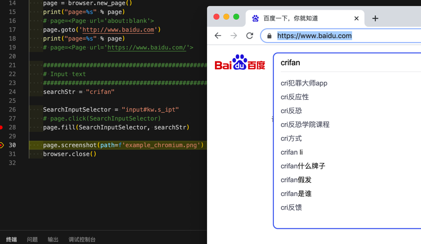

# 输入文字

给百度输入框中输入文字，的代码：

```python
    searchStr = "crifan"
    SearchInputSelector = "input#kw.s_ipt"
    page.fill(SearchInputSelector, searchStr)
```

效果：给百度搜索输入框中输入了文字



另：估计是先用`Selector`选择元素，再去用元素的`fill`也是可以的。

相关文档：[Text input](https://playwright.dev/docs/input/)

## 其他几种`fill`

另外还支持几种的`fill`：

* `page.fill(selector, value[, options])`
  * https://playwright.dev/docs/api/class-page#pagefillselector-value-options
* `frame.fill(selector, value[, options])`
  * https://playwright.dev/docs/api/class-frame#framefillselector-value-options
* `elementHandle.fill(value[, options])`
  * https://playwright.dev/docs/api/class-elementhandle#elementhandlefillvalue-options
