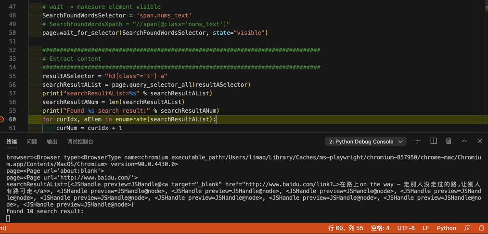

# 等待元素出现

用`page`的`wait_for_selector`

举例：

```python
    SearchFoundWordsSelector = 'span.nums_text'
    page.wait_for_selector(SearchFoundWordsSelector, state="visible")
```

效果：可以找到后续元素了



## 官网资料

* 相关资料
  * [page.wait_for_event(event, **kwargs)](https://playwright.dev/python/docs/api/class-page#pagewait_for_eventevent-kwargs)
  * [page.wait_for_function(expression, **kwargs)](https://playwright.dev/python/docs/api/class-page#pagewait_for_functionexpression-kwargs)
  * [page.wait_for_load_state(**kwargs)](https://playwright.dev/python/docs/api/class-page#pagewait_for_load_statekwargs)
  * [page.wait_for_selector(selector, **kwargs)](https://playwright.dev/python/docs/api/class-page#pagewait_for_selectorselector-kwargs)
  * [page.wait_for_timeout(timeout)](https://playwright.dev/python/docs/api/class-page#pagewait_for_timeouttimeout)
