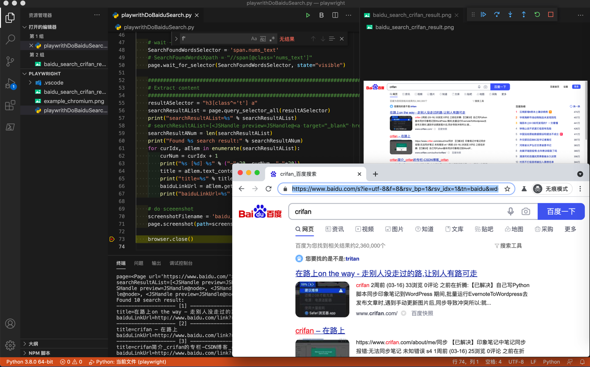

# 百度搜索自动化

此处给出用`playwright`模拟百度搜索，即百度搜索自动化的完整例子。

## 代码

* 文件下载：[playwrithDemoBaiduSearch.py](../assets/file/playwrithDemoBaiduSearch.py)
* 贴出代码

```python
# Function: Playwright demo baidu search
# Author: Crifan Li
# Update: 20210331

from playwright.sync_api import sync_playwright

# here use sync mode
with sync_playwright() as p:
    chromiumBrowserType = p.chromium
    print("chromiumBrowserType=%s" % chromiumBrowserType)
    browser = chromiumBrowserType.launch(headless=False)
    # chromiumBrowserType=<BrowserType name=chromium executable_path=/Users/limao/Library/Caches/ms-playwright/chromium-857950/chrome-mac/Chromium.app/Contents/MacOS/Chromium>
    print("browser=%s" % browser)
    # browser=<Browser type=<BrowserType name=chromium executable_path=/Users/limao/Library/Caches/ms-playwright/chromium-857950/chrome-mac/Chromium.app/Contents/MacOS/Chromium> version=90.0.4430.0>
    page = browser.new_page()
    print("page=%s" % page)
    # page=<Page url='about:blank'>

    ################################################################################
    # Open url
    ################################################################################
    page.goto('http://www.baidu.com')
    print("page=%s" % page)
    # page=<Page url='https://www.baidu.com/'>

    ################################################################################
    # Input text
    ################################################################################
    searchStr = "crifan"
    SearchInputSelector = "input#kw.s_ipt"

    # page.click(SearchInputSelector)
    page.fill(SearchInputSelector, searchStr)

    ################################################################################
    # Trigger search
    ################################################################################
    EnterKey = "Enter"

    # Method 1: press Enter key
    # page.keyboard.press(EnterKey)

    # Method 2: locate element then click
    SearchButtonSelector = "input#su"
    page.press(SearchButtonSelector, EnterKey)

    # wait -> makesure element visible
    SearchFoundWordsSelector = 'span.nums_text'
    # SearchFoundWordsXpath = "//span[@class='nums_text']"
    page.wait_for_selector(SearchFoundWordsSelector, state="visible")

    ################################################################################
    # Extract content
    ################################################################################
    resultASelector = "h3[class^='t'] a"
    searchResultAList = page.query_selector_all(resultASelector)
    print("searchResultAList=%s" % searchResultAList)
    # searchResultAList=[<JSHandle preview=JSHandle@<a target="_blank" href="http://www.baidu.com/link?…>在路上on the way - 走别人没走过的路,让别人有路可走</a>>, <JSHandle preview=JSHandle@node>, 。。。, <JSHandle preview=JSHandle@node>]
    searchResultANum = len(searchResultAList)
    print("Found %s search result:" % searchResultANum)
    for curIdx, aElem in enumerate(searchResultAList):
        curNum = curIdx + 1
        print("%s [%d] %s" % ("-"*20, curNum, "-"*20))
        title = aElem.text_content()
        print("title=%s" % title)
        # title=在路上on the way - 走别人没走过的路,让别人有路可走
        baiduLinkUrl = aElem.get_attribute("href")
        print("baiduLinkUrl=%s" % baiduLinkUrl)
        # baiduLinkUrl=http://www.baidu.com/link?url=fB3F0xZmwig9r2M_1pK4BJG00xFPLjJ85X39GheP_fzEA_zJIjX-IleEH_ZL8pfo

    # do sceeenshot
    screenshotFilename = 'baidu_search_%s_result.png' % searchStr
    page.screenshot(path=screenshotFilename)

    browser.close()
```

## 效果

### 视频

<video id="playwrithDemoBaiduSearch" controls="controls" preload="none" width="800" height="600">
  <source src="../assets/file/playwrithDemoBaiduSearch.mp4" type="video/mp4">
</video>

### 图



### 输出

```bash
chromiumBrowserType=<BrowserType name=chromium executable_path=/Users/limao/Library/Caches/ms-playwright/chromium-857950/chrome-mac/Chromium.app/Contents/MacOS/Chromium>
browser=<Browser type=<BrowserType name=chromium executable_path=/Users/limao/Library/Caches/ms-playwright/chromium-857950/chrome-mac/Chromium.app/Contents/MacOS/Chromium> version=90.0.4430.0>
page=<Page url='about:blank'>
page=<Page url='https://www.baidu.com/'>
searchResultAList=[<JSHandle preview=JSHandle@<a target="_blank" href="http://www.baidu.com/link?…>在路上on the way - 走别人没走过的路,让别人有路可走</a>>, <JSHandle preview=JSHandle@node>, <JSHandle preview=JSHandle@node>, <JSHandle preview=JSHandle@node>, <JSHandle preview=JSHandle@node>, <JSHandle preview=JSHandle@node>, <JSHandle preview=JSHandle@node>, <JSHandle preview=JSHandle@node>, <JSHandle preview=JSHandle@node>, <JSHandle preview=JSHandle@node>]
Found 10 search result:
-------------------- [1] --------------------
title=在路上on the way - 走别人没走过的路,让别人有路可走
baiduLinkUrl=http://www.baidu.com/link?url=fB3F0xZmwig9r2M_1pK4BJG00xFPLjJ85X39GheP_fzEA_zJIjX-IleEH_ZL8pfo
-------------------- [2] --------------------
title=crifan – 在路上
baiduLinkUrl=http://www.baidu.com/link?url=kmvgD1PraoULnnjUvNPQmwHFQ9uUKkXg_HWy0NI3xI11cV7evpdxyA_4FkVf3zLH
-------------------- [3] --------------------
title=crifan简介_crifan的专栏-CSDN博客_crifan
baiduLinkUrl=http://www.baidu.com/link?url=CHLWAQKOMgb23GmzVCZRIVze9kBNu6DIVoSWQqe21bWq_qZk2zDu_V3pDC1o1i5WC8qXAbUhaBIN8UO9Sjzxfa
-------------------- [4] --------------------
title=crifan的微博_微博
baiduLinkUrl=http://www.baidu.com/link?url=-QwlZ5SEmZD1R2QqdsK7ByUhxmIdX_hiFCX79hg9RTbQ11j5wXaBaYXegXU9WDk3
-------------------- [5] --------------------
title=Crifan的电子书大全 | crifan.github.io
baiduLinkUrl=http://www.baidu.com/link?url=Sgrbyd_pBsm-BTANKwSmyveSWvWj2_IqOOZzYw-SkG8tQ_C6Ccz88zZxHf3Eh1JA
-------------------- [6] --------------------
title=GitHub - crifan/crifanLib: crifan's library
baiduLinkUrl=http://www.baidu.com/link?url=NSZ5IzQ2Qag3CpGLMAbJer3QaAqI7qZOp2Ythiw6o8inoDX-5LqlzOKWTrMzQK5G
-------------------- [7] --------------------
title=在路上www.crifan.com - 网站排行榜
baiduLinkUrl=http://www.baidu.com/link?url=Tc4cbETNKpQXj-kX1pwSOcPG8l9ijRRPqokRSMHgB59rSn6GoWSBzCPu3ky3dN6Cu1pb-4HBZ2_YaVyS7qdDS_
-------------------- [8] --------------------
title=crifan的专栏_crifan_CSDN博客-crifan领域博主
baiduLinkUrl=http://www.baidu.com/link?url=OLkrWu8q9SRZuBN-KzEMO56f82IpIfvbOp-sU3jdjbVBPP3GXBw_8StJgYG-_QrK
-------------------- [9] --------------------
title=User crifan - Stack Overflow
baiduLinkUrl=http://www.baidu.com/link?url=t1rc0EGg33A-uJUiZHKkUWA8ETf6B5P8pBKo0yNCH-VTWluW3xqUlYRHjMz8bQdiN2mJROMhfkX6bY0db_bB_a
-------------------- [10] --------------------
title=crifan - Bing 词典
baiduLinkUrl=http://www.baidu.com/link?url=8z-3hYeLAQ8T4efOf4848LtAdpGdR1Ect9au4JIUB32bm2z412RDsMelFW1R2aIk
```
