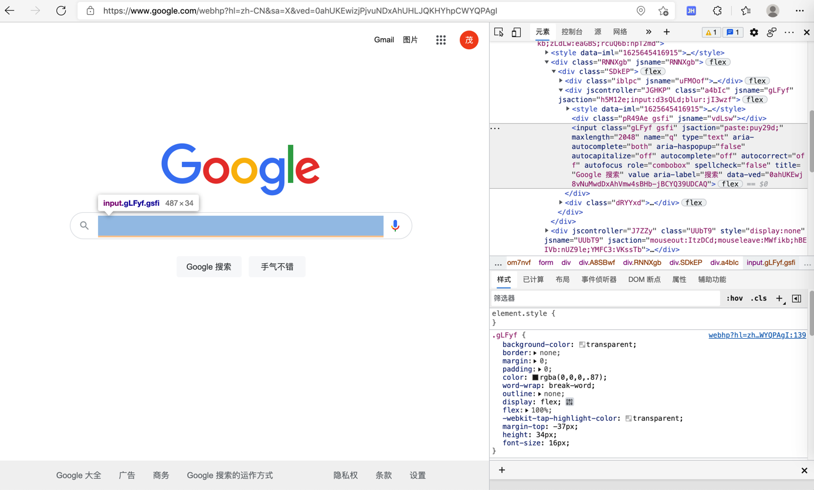
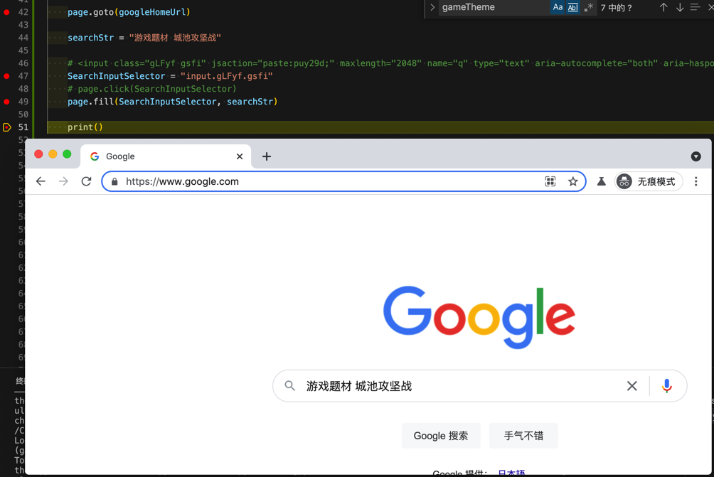
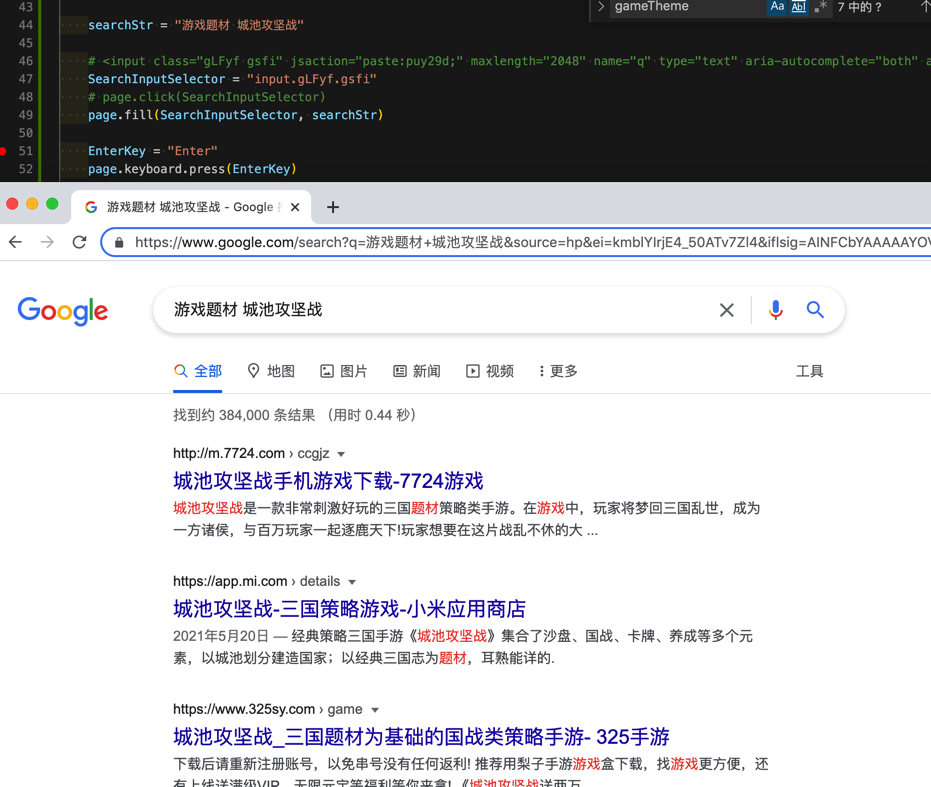
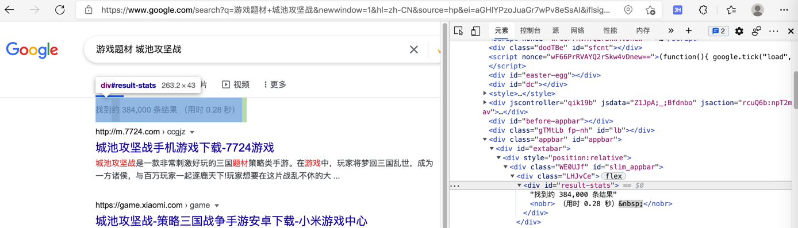
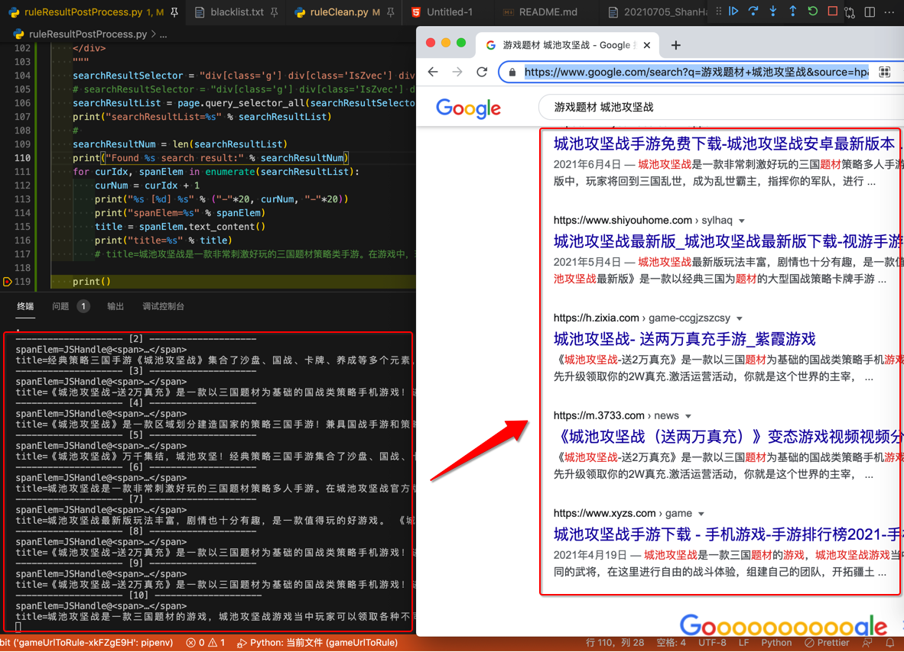
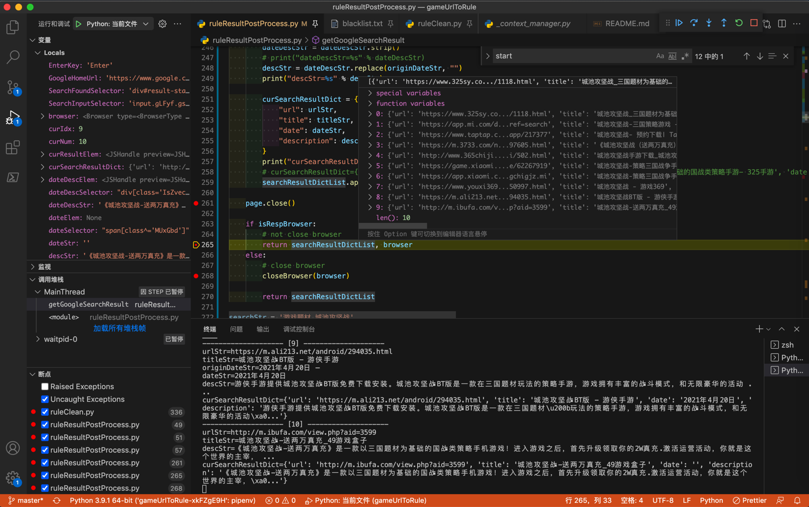
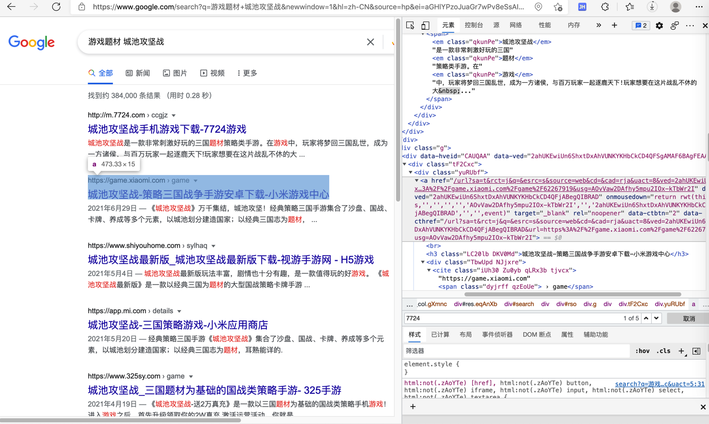
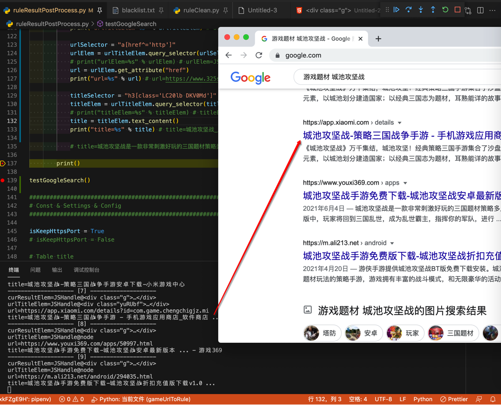
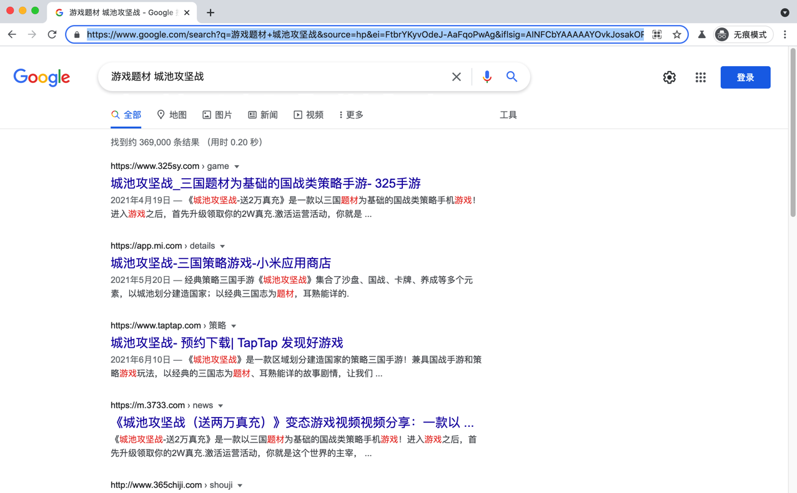

# 模拟谷歌搜索并获取结果

* 注：最新代码详见
  * https://github.com/crifan/crifanLibPython/blob/master/python3/crifanLib/thirdParty/crifanPlaywright.py

---

此处实现了，用Playwright模拟google谷歌搜索，并解析出第一页的搜索结果：


## 代码

### 浏览器和页面初始化

初始化浏览器和页面相关函数：

```python
from playwright.sync_api import sync_playwright

def initBrowser(browserType="chromium", browserConfig={"headless": False}):
    """
    For playwright, init to create a browser. For later use, such as google search

    Args:
        browserType (str): Playwright browser type: chromium / firefox / webkit
        browserConfig (dict): Playwright browser config. Default is {"headless": False}.
    Returns:
        BrowserType
    Examples:
        browserConfig
            {
                "headless": False,
                "proxy": {
                    "server": "http://127.0.0.1:58591",
                }
            }
    Raises:
    """
    curBrowserType = None

    if browserType:
        browserType = browserType.lower()

    # with sync_playwright() as p:
    # p = sync_playwright()
    p = sync_playwright().start()
    # 多次调用，会：
	# 发生异常: Error
    # It looks like you are using Playwright Sync API inside the asyncio loop.
    # Please use the Async API instead.

    if browserType == "chromium":
        curBrowserType = p.chromium
    elif browserType == "firefox":
        curBrowserType = p.firefox
    elif browserType == "webkit":
        curBrowserType = p.webkit
    print("curBrowserType=%s" % curBrowserType)
    # curBrowserType=<BrowserType name=chromium executable_path=/Users/limao/Library/Caches/ms-playwright/chromium-901522/chrome-mac/Chromium.app/Contents/MacOS/Chromium>

    if not curBrowserType:
        print("Unsupported playwright browser type: %s" % browserType)
        return None

    # browser = curBrowserType.launch(headless=False)
    # browser = curBrowserType.launch(**browserLaunchOptionDict)
    browser = curBrowserType.launch(**browserConfig)
    print("browser=%s" % browser)
    # browser=<Browser type=<BrowserType name=chromium executable_path=/Users/limao/Library/Caches/ms-playwright/chromium-901522/chrome-mac/Chromium.app/Contents/MacOS/Chromium> version=93.0.4576.0>

    return browser

def initPage(pageConfig=None, browser=None):
    """Init playwright browser new page

    Args:
        pageConfig (dict): page config. Default is None.
        browser (BrowserType): Playwright browser. Default is None. If None, create new one
    Returns:
        Page
    Examples:
        pageConfig
            {"pageLoadTimeout": 10}
    Raises:
    """
    if not browser:
        browser = initBrowser()

    page = browser.new_page()
    # print("page=%s" % page)

    if pageConfig:
        if "pageLoadTimeout" in pageConfig:
            curPageLoadTimeout = pageConfig["pageLoadTimeout"]
            curPageLoadTimeoutMilliSec = curPageLoadTimeout * 1000

            page.set_default_navigation_timeout(curPageLoadTimeoutMilliSec)
            page.set_default_timeout(curPageLoadTimeoutMilliSec)

    return page

def closeBrowser(browser):
    """
    For playwright, close browser

    Args:
        browser (BrowserType): Playwright browser
    Returns:
    Raises:
    """
    browser.close()
```

### 获取google搜索结果

模拟google搜索，返回搜索结果：

```python

def getGoogleSearchResult(searchKeyword, browser=None, isAutoCloseBrowser=False):
    """
    Emulate google search, return search result

    Args:
        searchKeyword (str): str to search
        browser (BrowserType): Playwright browser. Default is None. If None, create new one
        isAutoCloseBrowser (bool): whether auto close browser after search
    Returns:
        result dict list
    Raises:
    Examples:
        '游戏题材 城池攻坚战'
    """
    GoogleHomeUrl = "https://www.google.com/"

    searchResultDictList = []

    # if not browser:
    #     browser = initBrowser()

    # page = browser.new_page()
    # print("page=%s" % page)

    page = initPage(browser=browser)

    page.goto(GoogleHomeUrl)

    # <input class="gLFyf gsfi" jsaction="paste:puy29d;" maxlength="2048" name="q" type="text" aria-autocomplete="both" aria-haspopup="false" autocapitalize="off" autocomplete="off" autocorrect="off" autofocus="" role="combobox" spellcheck="false" title="Google 搜索" value="" aria-label="搜索" data-ved="0ahUKEwj8vNuMwdDxAhVmw4sBHb-jBCYQ39UDCAQ">
    SearchInputSelector = "input.gLFyf.gsfi"
    # page.click(SearchInputSelector)
    page.fill(SearchInputSelector, searchKeyword)

    EnterKey = "Enter"
    page.keyboard.press(EnterKey)

    # wait -> makesure element visible
    # <div id="result-stats">找到约 384,000 条结果<nobr> （用时 0.28 秒）&nbsp;</nobr></div>
    SearchFoundSelector = 'div#result-stats'
    page.wait_for_selector(SearchFoundSelector, state="visible")


    """
        <table class="AaVjTc" style="border-collapse:collapse;text-align:left" role="presentation">
            <tbody>
                <tr jsname="TeSSVd" valign="top">
                    <td class="d6cvqb"><span class="SJajHc"
                            style="background:url(/images/nav_logo321.webp) no-repeat;background-position:-24px 0;width:28px"></span>
                    </td>
                    <td class="YyVfkd"><span class="SJajHc"
                            style="background:url(/images/nav_logo321.webp) no-repeat;background-position:-53px 0;width:20px"></span>1
                    </td>
        。。。
                    <td><a aria-label="Page 10" class="fl"
                            href="/search?q=%E6%B8%B8%E6%88%8F%E9%A2%98%E6%9D%90+%E6%96%B0%E6%96%97%E7%BD%97%E5%A4%A7%E9%99%86&amp;ei=k-vrYIaDOa6Vr7wPsbaisAY&amp;start=90&amp;sa=N&amp;ved=2ahUKEwjGmIjb_dzxAhWuyosBHTGbCGYQ8tMDegQIARBN"><span
                                class="SJajHc NVbCr"
                                style="background:url(/images/nav_logo321.webp) no-repeat;background-position:-74px 0;width:20px"></span>10</a>
                    </td>
                    <td aria-level="3" class="d6cvqb" role="heading"><a
                            href="/search?q=%E6%B8%B8%E6%88%8F%E9%A2%98%E6%9D%90+%E6%96%B0%E6%96%97%E7%BD%97%E5%A4%A7%E9%99%86&amp;ei=k-vrYIaDOa6Vr7wPsbaisAY&amp;start=10&amp;sa=N&amp;ved=2ahUKEwjGmIjb_dzxAhWuyosBHTGbCGYQ8NMDegQIARBP"
                            id="pnnext" style="text-align:left"><span class="SJajHc NVbCr"
                                style="background:url(/images/nav_logo321.webp) no-repeat;background-position:-96px 0;width:71px"></span><span
                                style="display:block;margin-left:53px">下一页</span></a></td>
                </tr>
            </tbody>
        </table>

    """
    # 底部 Goooooooogle 多页面导航的部分，确保出现 -》 避免页面加载不完整，后续搜索结果只有2个，而不是完整的个数（一般是8/9/10个）
    # <table class="AaVjTc" style="border-collapse:collapse;text-align:left" role="presentation">
    bottomNaviPageSelector = "table[role='presentation']"
    page.wait_for_selector(bottomNaviPageSelector, state="visible")

    searchResultDictList = parseGoogleSearchResult(page)
    # searchResultNum = len(searchResultDictList)
    # print("searchResultNum=%s" % searchResultNum)

    page.close()

    if isAutoCloseBrowser:
        # close browser
        closeBrowser(browser)

    return searchResultDictList
```

### 解析google搜索结果

期间调用了：从搜索结果页面解析提取搜索结果内容：

```python

def parseGoogleSearchResult(page):
    """
    Parse google search result from current (search result) page

    Args:
        page (Page): playwright browser Page
    Returns:
        result dict list
    Raises:
    """
    searchResultDictList = []

    """
    <div class="g">
        <h2 class="Uo8X3b OhScic zsYMMe">网络搜索结果</h2>
        <div data-hveid="CAIQAA" data-ved="2ahUKEwiUn6ShxtDxAhVUNKYKHbCkCD4QFSgAMAB6BAgCEAA">
            <div class="tF2Cxc">
                <div class="yuRUbf"><a
                        href="/url?sa=t&amp;rct=j&amp;q=&amp;esrc=s&amp;source=web&amp;cd=&amp;cad=rja&amp;uact=8&amp;ved=2ahUKEwiUn6ShxtDxAhVUNKYKHbCkCD4QFjAAegQIAhAD&amp;url=http%3A%2F%2Fm.7724.com%2Fccgjz%2F&amp;usg=AOvVaw02ypkYtu3h9TQzpCu3biwN"
                        data-ved="2ahUKEwiUn6ShxtDxAhVUNKYKHbCkCD4QFjAAegQIAhAD"
                        onmousedown="return rwt(this,'','','','','AOvVaw02ypkYtu3h9TQzpCu3biwN','','2ahUKEwiUn6ShxtDxAhVUNKYKHbCkCD4QFjAAegQIAhAD','','',event)"
                        target="_blank" rel="noopener" data-ctbtn="2"
                        data-cthref="/url?sa=t&amp;rct=j&amp;q=&amp;esrc=s&amp;source=web&amp;cd=&amp;cad=rja&amp;uact=8&amp;ved=2ahUKEwiUn6ShxtDxAhVUNKYKHbCkCD4QFjAAegQIAhAD&amp;url=http%3A%2F%2Fm.7724.com%2Fccgjz%2F&amp;usg=AOvVaw02ypkYtu3h9TQzpCu3biwN"><br>
                        <h3 class="LC20lb DKV0Md">城池攻坚战手机游戏下载-7724游戏</h3>
                        。。。。。。
                    </div>
                </div>
                <div class="IsZvec">
                    <div class="VwiC3b yXK7lf MUxGbd yDYNvb lyLwlc"><span><em class="qkunPe">城池攻坚战</em>是一款非常刺激好玩的三国<em
                                class="qkunPe">题材</em>策略类手游。在<em
                                class="qkunPe">游戏</em>中，玩家将梦回三国乱世，成为一方诸侯，与百万玩家一起逐鹿天下!玩家想要在这片战乱不休的大&nbsp;...</span></div>
                </div>
            </div>
        </div>
    </div>
    。。。

    <div class="g">
        <div data-hveid="CA4QAA" data-ved="2ahUKEwiUn6ShxtDxAhVUNKYKHbCkCD4QFSgAMAl6BAgOEAA">
            <div class="tF2Cxc">
                <div class="yuRUbf"><a href="https://www.diyiyou.com/zt/zlccdyx/"
                        data-ved="2ahUKEwiUn6ShxtDxAhVUNKYKHbCkCD4QFjAJegQIDhAD"
                        onmousedown="return rwt(this,'','','','','AOvVaw2YT1TExiYAGLEIgDsnscDf','','2ahUKEwiUn6ShxtDxAhVUNKYKHbCkCD4QFjAJegQIDhAD','','',event)"
                        target="_blank" rel="noopener"><br>
                        <h3 class="LC20lb DKV0Md">占领城池的游戏推荐-耐玩的占领城池的游戏合集-第一手游网</h3>
                        。。。。。。
                </div>
                <div class="IsZvec">
                    <div class="VwiC3b yXK7lf MUxGbd yDYNvb lyLwlc"><span class="MUxGbd wuQ4Ob WZ8Tjf">2020年12月26日 —
                        </span><span>推荐理由：<em class="qkunPe">城池攻坚战</em>是一款大型战争策略<em class="qkunPe">题材</em>的即时竞技类型手游，<em
                                class="qkunPe">游戏</em>以多元化兵种设定，加深战场交锋的策略地位，大气磅礴的三国古战场&nbsp;...</span></div>
                </div>
            </div>
        </div>
    </div>

    ...

    <div class="g">
        <div data-hveid="CAgQAA" data-ved="2ahUKEwi5upCe5NzxAhXLbt4KHXSLBz8QFSgAMAd6BAgIEAA">
            <div class="tF2Cxc">
                <div class="yuRUbf"><a href="https://www.youxi369.com/apps/50997.html"
                        data-ved="2ahUKEwi5upCe5NzxAhXLbt4KHXSLBz8QFjAHegQICBAD"
                        ping="/url?sa=t&amp;source=web&amp;rct=j&amp;url=https://www.youxi369.com/apps/50997.html&amp;ved=2ahUKEwi5upCe5NzxAhXLbt4KHXSLBz8QFjAHegQICBAD"><br>
                        <h3 class="LC20lb DKV0Md">城池攻坚战手游免费下载-城池攻坚战安卓最新版本 ... - 游戏369</h3>
                        <div class="TbwUpd NJjxre"><cite class="iUh30 Zu0yb qLRx3b tjvcx">https://www.youxi369.com<span
                                    class="dyjrff qzEoUe"> › apps</span></cite></div>
                    </a>
                    <div class="B6fmyf">
                        <div class="TbwUpd"><cite class="iUh30 Zu0yb qLRx3b tjvcx">https://www.youxi369.com<span
                                    class="dyjrff qzEoUe"> › apps</span></cite></div>
                        <div class="eFM0qc"><span>
                                <div jscontroller="hiU8Ie" class="action-menu"><a class="GHDvEf" href="#" aria-label="结果选项"
                                        aria-expanded="false" aria-haspopup="true" role="button"
                                        jsaction="PZcoEd;keydown:wU6FVd;keypress:uWmNaf"
                                        data-ved="2ahUKEwi5upCe5NzxAhXLbt4KHXSLBz8Q7B0wB3oECAgQBg"><span
                                            class="gTl8xb"></span></a>
                                    <ol class="action-menu-panel zsYMMe" role="menu" tabindex="-1"
                                        jsaction="keydown:Xiq7wd;mouseover:pKPowd;mouseout:O9bKS"
                                        data-ved="2ahUKEwi5upCe5NzxAhXLbt4KHXSLBz8QqR8wB3oECAgQBw">
                                        <li class="action-menu-item OhScic zsYMMe" role="menuitem"><a class="fl"
                                                href="https://webcache.googleusercontent.com/search?q=cache:SGA7R-UcWfEJ:https://www.youxi369.com/apps/50997.html+&amp;cd=8&amp;hl=zh-CN&amp;ct=clnk&amp;gl=jp"
                                                ping="/url?sa=t&amp;source=web&amp;rct=j&amp;url=https://webcache.googleusercontent.com/search%3Fq%3Dcache:SGA7R-UcWfEJ:https://www.youxi369.com/apps/50997.html%2B%26cd%3D8%26hl%3Dzh-CN%26ct%3Dclnk%26gl%3Djp&amp;ved=2ahUKEwi5upCe5NzxAhXLbt4KHXSLBz8QIDAHegQICBAI"><span>网页快照</span></a>
                                        </li>
                                    </ol>
                                </div>
                            </span></div>
                    </div>
                </div>
                <div class="IsZvec">
                    <div class="VwiC3b MUxGbd yDYNvb lyLwlc"><span class="MUxGbd wuQ4Ob WZ8Tjf">2021年6月4日 —
                        </span>城池攻坚战是一款非常刺激好玩的三国题材策略多人手游。在城池攻坚战官方版中，玩家将回到三国乱世，成为乱世霸主，指挥你的军队，进行&nbsp;...</div>
                </div>
            </div>
        </div>
    </div>

    """
    # searchResultSelector = "div[class='g'] div[class='IsZvec'] div span:last-child"
    # searchResultSelector = "div[class='g'] div[class='IsZvec'] div span:first-child"
    searchResultSelector = "div[class='g']"
    searchResultList = page.query_selector_all(searchResultSelector)
    # print("searchResultList=%s" % searchResultList)
    # searchResultList=[<JSHandle preview=JSHandle@node>, <JSHandle preview=JSHandle@node>, <JSHandle preview=JSHandle@node>, <JSHandle preview=JSHandle@node>, <JSHandle preview=JSHandle@node>, <JSHandle preview=JSHandle@node>, <JSHandle preview=JSHandle@node>, <JSHandle preview=JSHandle@node>, <JSHandle preview=JSHandle@node>]
    searchResultNum = len(searchResultList)
    # print("Found %s search result" % searchResultNum) # 9, 10

    # for debug
    # if searchResultNum < 8:
    if searchResultNum < 5:
        print("Unexpcted too little result count: %s" % searchResultNum)

    for curIdx, curResultElem in enumerate(searchResultList):
        curNum = curIdx + 1
        # print("%s [%d] %s" % ("-"*20, curNum, "-"*20))
        # print("curResultElem=%s" % curResultElem)

        # urlTitleElemSelector = "div[class='tF2Cxc']"
        urlTitleSelector = "div[class='tF2Cxc'] div[class='yuRUbf']"
        urlTitleElem = curResultElem.query_selector(urlTitleSelector)
        # print("urlTitleElem=%s" % urlTitleElem) # urlTitleElem=JSHandle@<div class="yuRUbf">…</div>

        urlSelector = "a[href^='http']"
        urlElem = urlTitleElem.query_selector(urlSelector)
        # print("urlElem=%s" % urlElem) # urlElem=JSHandle@node
        urlStr = urlElem.get_attribute("href")
        # print("urlStr=%s" % urlStr) # urlStr=https://www.325sy.com/game/1118.html

        titleSelector = "h3[class='LC20lb DKV0Md']"
        titleElem = urlTitleElem.query_selector(titleSelector)
        # print("titleElem=%s" % titleElem) # titleElem=JSHandle@node
        titleStr = titleElem.text_content()
        # print("titleStr=%s" % titleStr) # titleStr=城池攻坚战_三国题材为基础的国战类策略手游- 325手游

        dateDescSelector = "div[class='IsZvec'] div[class^='VwiC3b']"
        dateDescElem = curResultElem.query_selector(dateDescSelector)

        # spanElemList = dateDescElem.query_selector_all("span")
        dateStr = ""
        originDateStr = ""
        dateSelector = "span[class^='MUxGbd']"
        dateElem = dateDescElem.query_selector(dateSelector) # None
        if dateElem:
            originDateStr = dateElem.text_content()
            # print("originDateStr=%s" % originDateStr) # '2021年4月19日 —'
            dateStr = originDateStr.replace(" — ", "")
            # print("dateStr=%s" % dateStr) # '2021年4月19日'

        dateDescStr = dateDescElem.text_content() # '下载后请重新注册账号，以免串号没有任何返利! 推荐用梨子手游游戏盒下载，找游戏更方便，还有上线送满级VIP、无限元宝等福利等你来拿! 《城池攻坚战送两万\xa0...'
        dateDescStr = dateDescStr.strip()
        # print("dateDescStr=%s" % dateDescStr)
        descStr = dateDescStr.replace(originDateStr, "")
        # print("descStr=%s" % descStr)

        curSearchResultDict = {
            "url": urlStr,
            "title": titleStr,
            "date": dateStr,
            "description": descStr,
        }
        # print("curSearchResultDict=%s" % curSearchResultDict)
        # curSearchResultDict={'url': 'https://www.325sy.com/game/1118.html', 'title': '城池攻坚战_三国题材为基础的国战类策略手游- 325手游', 'date': '2021年4月19日', 'description': '《城池攻坚战-送2万真充》是一款以三国题材为基础的国战类策略手机游戏！进入游戏之后，首先升级领取你的2W真充.激活运营活动，你就是\xa0...'}
        searchResultDictList.append(curSearchResultDict)

    return searchResultDictList
```

## 代码调用

```python
# test code
PROXY_HTTP = "http://127.0.0.1:58591"
PROXY_SOCKS5 = "socks5://127.0.0.1:51837"
browserConfig = {
    "headless": False,
    # "headless": True,
    "proxy": {
        "server": PROXY_HTTP,
    }
}
browser = initBrowser(browserConfig=browserConfig)

searchStr = '游戏题材 新斗罗大陆'
resultDictList = getGoogleSearchResult(searchStr, browser=browser)
resultNum = len(resultDictList)
print("Google search %s found %s result" % (searchStr, resultNum))

searchStr = '游戏题材 城池攻坚战'
resultDictList = getGoogleSearchResult(searchStr, browser=browser)
resultNum = len(resultDictList)
print("Google search %s found %s result" % (searchStr, resultNum))

closeBrowser(browser)
```

## 页面和html和调试

### 模拟google搜索

* 搜索输入框
  * 
  * html
    ```html
    <input class="gLFyf gsfi" jsaction="paste:puy29d;" maxlength="2048" name="q" type="text" aria-autocomplete="both" aria-haspopup="false" autocapitalize="off" autocomplete="off" autocorrect="off" autofocus="" role="combobox" spellcheck="false" title="Google 搜索" value="" aria-label="搜索" data-ved="0ahUKEwj8vNuMwdDxAhVmw4sBHb-jBCYQ39UDCAQ">
    ```
* 已输入要搜索的文字
  * 
* 触发了搜索
  * 
* 等待页面加载完毕：出现`找到约 xxx 条结果`
  * 
  * html
    ```html
    <div id="result-stats">找到约 384,000 条结果<nobr> （用时 0.28 秒）&nbsp;</nobr></div>
    ```
* 已解析可输出每个结果的标题
  * 
* 返回10个搜索结果
  * 

### google搜索结果页

* 搜索结果页
  * 
    * html
        ```html
        <div class="g">
            <div data-hveid="CAUQAA" data-ved="2ahUKEwiUn6ShxtDxAhVUNKYKHbCkCD4QFSgAMAF6BAgFEAA">
                <div class="tF2Cxc">
                    <div class="yuRUbf"><a
                            href="/url?sa=t&amp;rct=j&amp;q=&amp;esrc=s&amp;source=web&amp;cd=&amp;cad=rja&amp;uact=8&amp;ved=2ahUKEwiUn6ShxtDxAhVUNKYKHbCkCD4QFjABegQIBRAD&amp;url=https%3A%2F%2Fgame.xiaomi.com%2Fgame%2F62267919&usg=AOvVaw2DAfhy5mpu2IOx-kTbWr2I"
                            data-ved="2ahUKEwiUn6ShxtDxAhVUNKYKHbCkCD4QFjABegQIBRAD"
                            onmousedown="return rwt(this,'','','','','AOvVaw2DAfhy5mpu2IOx-kTbWr2I','','2ahUKEwiUn6ShxtDxAhVUNKYKHbCkCD4QFjABegQIBRAD','','',event)"
                            target="_blank" rel="noopener" data-ctbtn="2"
                            data-cthref="/url?sa=t&amp;rct=j&amp;q=&amp;esrc=s&amp;source=web&amp;cd=&amp;cad=rja&amp;uact=8&amp;ved=2ahUKEwiUn6ShxtDxAhVUNKYKHbCkCD4QFjABegQIBRAD&amp;url=https%3A%2F%2Fgame.xiaomi.com%2Fgame%2F62267919&usg=AOvVaw2DAfhy5mpu2IOx-kTbWr2I">

                            <h3 class="LC20lb DKV0Md">城池攻坚战-策略三国战争手游安卓下载-小米游戏中心</h3>
                            <div class="TbwUpd NJjxre"><cite class="iUh30 Zu0yb qLRx3b tjvcx">https://game.xiaomi.com<span
                                        class="dyjrff qzEoUe"> › game</span></cite></div>
                        </a>
                        <div class="B6fmyf">
                            <div class="TbwUpd"><cite class="iUh30 Zu0yb qLRx3b tjvcx">https://game.xiaomi.com<span
                                        class="dyjrff qzEoUe"> › game</span></cite></div>
                            <div class="eFM0qc"><span>
                                    <div jscontroller="hiU8Ie" class="action-menu"><a class="GHDvEf" href="#" aria-label="结果选项"
                                            aria-expanded="false" aria-haspopup="true" role="button"
                                            jsaction="PZcoEd;keydown:wU6FVd;keypress:uWmNaf"
                                            data-ved="2ahUKEwiUn6ShxtDxAhVUNKYKHbCkCD4Q7B0wAXoECAUQBg"><span
                                                class="gTl8xb"></span></a>
                                        <ol class="action-menu-panel zsYMMe" role="menu" tabindex="-1"
                                            jsaction="keydown:Xiq7wd;mouseover:pKPowd;mouseout:O9bKS"
                                            data-ved="2ahUKEwiUn6ShxtDxAhVUNKYKHbCkCD4QqR8wAXoECAUQBw">
                                            <li class="action-menu-item OhScic zsYMMe" role="menuitem"><a class="fl"
                                                    href="https://webcache.googleusercontent.com/search?q=cache:qMSNJUsA4a0J:https://game.xiaomi.com/game/62267919+&cd=2&hl=zh-CN&ct=clnk"
                                                    onmousedown="return rwt(this,'','','','','AOvVaw1tf3IRFX3HzbRjQFxdt3A4','','2ahUKEwiUn6ShxtDxAhVUNKYKHbCkCD4QIDABegQIBRAI','','',event)"
                                                    target="_blank" rel="noopener"><span>网页快照</span></a></li>
                                        </ol>
                                    </div>
                                </span></div>
                        </div>
                    </div>
                    <div class="IsZvec">
                        <div class="VwiC3b yXK7lf MUxGbd yDYNvb lyLwlc"><span class="MUxGbd wuQ4Ob WZ8Tjf">2021年6月29日 —
                            </span><span>《<em
                                    class="qkunPe">城池攻坚战</em>》万千集结，城池攻坚！经典策略三国手游集合了沙盘、国战、卡牌、养成等多个元素，以城池划分建造国家；以经典三国志为<em
                                    class="qkunPe">题材</em>，&nbsp;...</span></div>
                    </div>
                </div>
            </div>
        </div>
        ```
  * 
  * 
  * 
    * 部分的html

```html
<div class="g">
    <h2 class="Uo8X3b OhScic zsYMMe">网络搜索结果</h2>
    <div data-hveid="CAIQAA" data-ved="2ahUKEwiUn6ShxtDxAhVUNKYKHbCkCD4QFSgAMAB6BAgCEAA">
        <div class="tF2Cxc">
            <div class="yuRUbf"><a
                    href="/url?sa=t&amp;rct=j&amp;q=&amp;esrc=s&amp;source=web&amp;cd=&amp;cad=rja&amp;uact=8&amp;ved=2ahUKEwiUn6ShxtDxAhVUNKYKHbCkCD4QFjAAegQIAhAD&amp;url=http%3A%2F%2Fm.7724.com%2Fccgjz%2F&usg=AOvVaw02ypkYtu3h9TQzpCu3biwN"
                    data-ved="2ahUKEwiUn6ShxtDxAhVUNKYKHbCkCD4QFjAAegQIAhAD"
                    onmousedown="return rwt(this,'','','','','AOvVaw02ypkYtu3h9TQzpCu3biwN','','2ahUKEwiUn6ShxtDxAhVUNKYKHbCkCD4QFjAAegQIAhAD','','',event)"
                    target="_blank" rel="noopener" data-ctbtn="2"
                    data-cthref="/url?sa=t&amp;rct=j&amp;q=&amp;esrc=s&amp;source=web&amp;cd=&amp;cad=rja&amp;uact=8&amp;ved=2ahUKEwiUn6ShxtDxAhVUNKYKHbCkCD4QFjAAegQIAhAD&amp;url=http%3A%2F%2Fm.7724.com%2Fccgjz%2F&usg=AOvVaw02ypkYtu3h9TQzpCu3biwN">

                    <h3 class="LC20lb DKV0Md">城池攻坚战手机游戏下载-7724游戏</h3>
                    。。。。。。
                </div>
            </div>
            <div class="IsZvec">
                <div class="VwiC3b yXK7lf MUxGbd yDYNvb lyLwlc"><span><em class="qkunPe">城池攻坚战</em>是一款非常刺激好玩的三国<em
                            class="qkunPe">题材</em>策略类手游。在<em
                            class="qkunPe">游戏</em>中，玩家将梦回三国乱世，成为一方诸侯，与百万玩家一起逐鹿天下!玩家想要在这片战乱不休的大&nbsp;...</span></div>
            </div>
        </div>
    </div>
</div>


<div class="g">
    <div data-hveid="CA4QAA" data-ved="2ahUKEwiUn6ShxtDxAhVUNKYKHbCkCD4QFSgAMAl6BAgOEAA">
        <div class="tF2Cxc">
            <div class="yuRUbf"><a href="https://www.diyiyou.com/zt/zlccdyx/"
                    data-ved="2ahUKEwiUn6ShxtDxAhVUNKYKHbCkCD4QFjAJegQIDhAD"
                    onmousedown="return rwt(this,'','','','','AOvVaw2YT1TExiYAGLEIgDsnscDf','','2ahUKEwiUn6ShxtDxAhVUNKYKHbCkCD4QFjAJegQIDhAD','','',event)"
                    target="_blank" rel="noopener">

                    <h3 class="LC20lb DKV0Md">占领城池的游戏推荐-耐玩的占领城池的游戏合集-第一手游网</h3>
                    。。。。。。
            </div>
            <div class="IsZvec">
                <div class="VwiC3b yXK7lf MUxGbd yDYNvb lyLwlc"><span class="MUxGbd wuQ4Ob WZ8Tjf">2020年12月26日 —
                    </span><span>推荐理由：<em class="qkunPe">城池攻坚战</em>是一款大型战争策略<em class="qkunPe">题材</em>的即时竞技类型手游，<em
                            class="qkunPe">游戏</em>以多元化兵种设定，加深战场交锋的策略地位，大气磅礴的三国古战场&nbsp;...</span></div>
            </div>
        </div>
    </div>
</div>


<div class="g">
    <div data-hveid="CAgQAA" data-ved="2ahUKEwi5upCe5NzxAhXLbt4KHXSLBz8QFSgAMAd6BAgIEAA">
        <div class="tF2Cxc">
            <div class="yuRUbf"><a href="https://www.youxi369.com/apps/50997.html"
                    data-ved="2ahUKEwi5upCe5NzxAhXLbt4KHXSLBz8QFjAHegQICBAD"
                    ping="/url?sa=t&amp;source=web&amp;rct=j&amp;url=https://www.youxi369.com/apps/50997.html&ved=2ahUKEwi5upCe5NzxAhXLbt4KHXSLBz8QFjAHegQICBAD">

                    <h3 class="LC20lb DKV0Md">城池攻坚战手游免费下载-城池攻坚战安卓最新版本 ... - 游戏369</h3>
                    <div class="TbwUpd NJjxre"><cite class="iUh30 Zu0yb qLRx3b tjvcx">https://www.youxi369.com<span
                                class="dyjrff qzEoUe"> › apps</span></cite></div>
                </a>
                <div class="B6fmyf">
                    <div class="TbwUpd"><cite class="iUh30 Zu0yb qLRx3b tjvcx">https://www.youxi369.com<span
                                class="dyjrff qzEoUe"> › apps</span></cite></div>
                    <div class="eFM0qc"><span>
                            <div jscontroller="hiU8Ie" class="action-menu"><a class="GHDvEf" href="#" aria-label="结果选项"
                                    aria-expanded="false" aria-haspopup="true" role="button"
                                    jsaction="PZcoEd;keydown:wU6FVd;keypress:uWmNaf"
                                    data-ved="2ahUKEwi5upCe5NzxAhXLbt4KHXSLBz8Q7B0wB3oECAgQBg"><span
                                        class="gTl8xb"></span></a>
                                <ol class="action-menu-panel zsYMMe" role="menu" tabindex="-1"
                                    jsaction="keydown:Xiq7wd;mouseover:pKPowd;mouseout:O9bKS"
                                    data-ved="2ahUKEwi5upCe5NzxAhXLbt4KHXSLBz8QqR8wB3oECAgQBw">
                                    <li class="action-menu-item OhScic zsYMMe" role="menuitem"><a class="fl"
                                            href="https://webcache.googleusercontent.com/search?q=cache:SGA7R-UcWfEJ:https://www.youxi369.com/apps/50997.html+&cd=8&hl=zh-CN&ct=clnk&gl=jp"
                                            ping="/url?sa=t&amp;source=web&amp;rct=j&amp;url=https://webcache.googleusercontent.com/search%3Fq%3Dcache:SGA7R-UcWfEJ:https://www.youxi369.com/apps/50997.html%2B%26cd%3D8%26hl%3Dzh-CN%26ct%3Dclnk%26gl%3Djp&ved=2ahUKEwi5upCe5NzxAhXLbt4KHXSLBz8QIDAHegQICBAI"><span>网页快照</span></a>
                                    </li>
                                </ol>
                            </div>
                        </span></div>
                </div>
            </div>
            <div class="IsZvec">
                <div class="VwiC3b MUxGbd yDYNvb lyLwlc"><span class="MUxGbd wuQ4Ob WZ8Tjf">2021年6月4日 —
                    </span>城池攻坚战是一款非常刺激好玩的三国题材策略多人手游。在城池攻坚战官方版中，玩家将回到三国乱世，成为乱世霸主，指挥你的军队，进行&nbsp;...</div>
            </div>
        </div>
    </div>
</div>
```

## 输出结果

举例1：

```bash
Found 9 search result:
-------------------- [1] --------------------
curResultElem=JSHandle@node
urlTitleElem=JSHandle@<div class="yuRUbf">…</div>
url=https://www.325sy.com/game/1118.html
title=城池攻坚战_三国题材为基础的国战类策略手游- 325手游
-------------------- [2] --------------------
curResultElem=JSHandle@<div class="g">…</div>
urlTitleElem=JSHandle@node
url=https://app.mi.com/details?id=com.game.chengchigjz.mi&ref=search
title=城池攻坚战-三国策略游戏-小米应用商店
-------------------- [3] --------------------
curResultElem=JSHandle@<div class="g">…</div>
urlTitleElem=JSHandle@<div class="yuRUbf">…</div>
url=https://www.taptap.com/app/217377
title=城池攻坚战- 预约下载| TapTap 发现好游戏
-------------------- [4] --------------------
curResultElem=JSHandle@<div class="g">…</div>
urlTitleElem=JSHandle@node
url=https://m.3733.com/news/197605.html
title=《城池攻坚战（送两万真充）》变态游戏视频视频分享：一款以三国 ...
-------------------- [5] --------------------
curResultElem=JSHandle@<div class="g">…</div>
urlTitleElem=JSHandle@node
url=http://www.365chiji.com/shouji/502.html
title=城池攻坚战手游下载_城池攻坚战游戏安卓版下载_三六五吃鸡
-------------------- [6] --------------------
curResultElem=JSHandle@<div class="g">…</div>
urlTitleElem=JSHandle@node
url=https://game.xiaomi.com/game/62267919
title=城池攻坚战-策略三国战争手游安卓下载-小米游戏中心
-------------------- [7] --------------------
curResultElem=JSHandle@<div class="g">…</div>
urlTitleElem=JSHandle@<div class="yuRUbf">…</div>
url=https://app.xiaomi.com/details?id=com.game.chengchigjz.mi
title=城池攻坚战-策略三国战争手游 - 手机游戏应用商店_软件商店 ...
-------------------- [8] --------------------
curResultElem=JSHandle@<div class="g">…</div>
urlTitleElem=JSHandle@node
url=https://www.youxi369.com/apps/50997.html
title=城池攻坚战手游免费下载-城池攻坚战安卓最新版本 ... - 游戏369
-------------------- [9] --------------------
curResultElem=JSHandle@<div class="g">…</div>
urlTitleElem=JSHandle@node
url=https://m.ali213.net/android/294035.html
title=城池攻坚战手游免费版下载-城池攻坚战折扣充值版下载v1.0 ...
```

举例2：

```bash
Found 8 search result:
-------------------- [1] --------------------
curSearchResultDict={'url': 'https://shouji.newyx.net/top/dldltc.html', 'title': '斗罗大陆题材手游哪个最好玩 - 牛游戏网', 'date': '', 'description': '斗罗大陆是我们非常熟悉的小说IP，小编为大家整理的斗罗大陆题材排行榜都是十分还原小说的游戏，里面熟悉的角色一一呈现在玩家面前，里面有创新的玩法，\u200b\xa0...'}
-------------------- [2] --------------------
curSearchResultDict={'url': 'https://zhuanlan.zhihu.com/p/383284290', 'title': '新斗罗大陆X预测服务丨卡牌游戏如何借力AI数据，有效提升 ...', 'date': '2021年6月24日', 'description': '随着同IP题材竞品的不断涌现，用户流失风险预警并针对性干预召回，成为其产品运营的核心工作之一。 下面将结合新斗罗大陆使用华为AppGallery\xa0...'}
。。。
-------------------- [7] --------------------
curSearchResultDict={'url': 'https://www.taptap.com/app/135987/review', 'title': '新斗罗大陆- 玩家评价| TapTap 发现好游戏', 'date': '', 'description': '新斗罗大陆好不好玩？阅读真实详尽的玩家评价，发现游戏的优点与不足，与开发者近距离交流反馈，轻松了解游戏的真实面貌。'}
-------------------- [8] --------------------
curSearchResultDict={'url': 'http://www.te5.com/game/450202.html', 'title': '【新斗罗大陆H52021最新版】新斗罗大陆H5免费版下载_特玩 ...', 'date': '', 'description': '新斗罗大陆H52021最新版下载是一款非常火爆的修仙题材的rpg手游，大型游戏，\u200b多人在线，海量用户与你同乐。游戏根据重量级IP，唐家三少的原著精品进行\xa0...'}
searchResultNum=8
Google search 游戏题材 新斗罗大陆 found 8 result
page=<Page url='about:blank'>
Found 9 search result:
-------------------- [1] --------------------
curSearchResultDict={'url': 'https://www.325sy.com/game/1118.html', 'title': '城池攻坚战_三国题材为基础的国战类策略手游- 325手游', 'date': '2021年4月19日', 'description': '《城池攻坚战-送2万真充》是一款以三国题材为基础的国战类策略手机游戏！进入游戏之后，首先升级领取你的2W真充.激活运营活动，你就是\xa0...'}
。。。
-------------------- [9] --------------------
curSearchResultDict={'url': 'https://www.3839.com/a/134478.htm', 'title': '城池攻坚战下载_城池攻坚战官方版下载-好游快爆APP', 'date': '2021年6月10日', 'description': '《城池攻坚战》是一款区域划分建造国家的策略三国手游！兼具国战手游和策略游戏玩法，以经典的三国志为题材、耳熟能详的故事剧情，让我们\xa0...'}
searchResultNum=9
Google search 游戏题材 城池攻坚战 found 9 result
```
