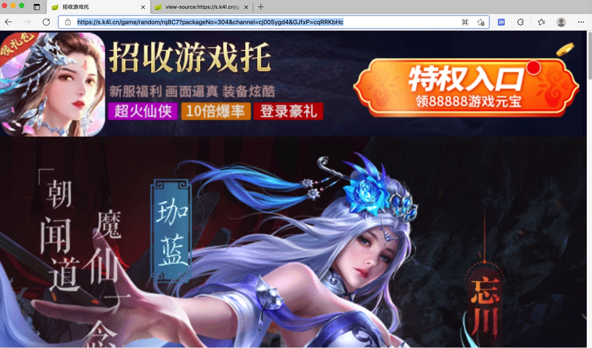

## 其他小例子

此处给出一些其他的Playwright的应用案例：

## 用Playwright实现短链解析长链

代码：

```python

def parseUrl(inputUrl, page=None):
    """Parse (redirected final long) url, title, html from input (possible short link) url

    Args:
        inputUrl (dict): input original (short link) url
        page (Page): Playwright page. Default is None. If None, create a new one.
    Returns:
        parse result(dict)
    Raises:
    """
    respValue = None

    if not page:
        page = initPage()

    try:
        page.goto(inputUrl)

        parsedLongLink = page.url # https://api.interactive.angpi.cn/interactive.htm?dateUnix=1588341459669&adSpaceCode=MEDIA200501215739781110&tinyUrl=5NGSFX&domain=m6z.cn&bulletinId=66e0953cdc614aa6a72eb44ba7927b71&sys=pc&tencent=0&reqId=66e0953cdc614aa6a72eb44ba7927b71&mediaRequestId=66e0953cdc614aa6a72eb44ba7927b71
        logging.debug("parsedLongLink=%s", parsedLongLink) # 'https://miyuanxp1260.kuaizhan.com/?inviteCode=RWXK5M&osType=1'
        longLinkTitle = page.title() # '现金大派送'
        logging.debug("longLinkTitle=%s", longLinkTitle)
        longLinkHtml = page.content()
        logging.debug("longLinkHtml=%s", longLinkHtml)

        respValue = {
            "isParseOk": True,
            "url": parsedLongLink,
            "title": longLinkTitle,
            "html": longLinkHtml,
        }
    except Exception as err:
        errStr = str(err)
        # 'net::ERR_NAME_NOT_RESOLVED at http://dmh2.cn/9jaSp0\n=========================== logs ===========================\nnavigating to "http://dmh2.cn/9jaSp0", waiting until "load"\n============================================================\nNote: use DEBUG=pw:api environment variable to capture Playwright logs.'
        # 'net::ERR_CONNECTION_CLOSED at http://zhongan.com/Ahita\n=========================== logs ===========================\nnavigating to "http://zhongan.com/Ahita", waiting until "load"\n============================================================\nNote: use DEBUG=pw:api environment variable to capture Playwright logs.'
        # 'Timeout 10000ms exceeded.\n=========================== logs ===========================\nnavigating to "http://zhongan.com/Ahita", waiting until "load"\n============================================================\nNote: use DEBUG=pw:api environment variable to capture Playwright logs.'
        # 
        logging.debug("Playwright goto %s exception: %s", inputUrl, errStr)

        respValue = {
            "isParseOk": False,
            "errMsg": errStr, 
        }

    return respValue
```

* 注：最新代码详见
  * https://github.com/crifan/crifanLibPython/blob/master/python3/crifanLib/thirdParty/crifanPlaywright.py

举例：

* 输入：
  * https://urldx.cn/9MUPowKt
* 输出
```json
{
    "isParseOk": true,
    "url": "https://s.k4l.cn/game/random/rq8C7?packageNo=304&channel=cj005ygd4&GJfxP=cqRRKbHc",
    "title": "招收游戏托",
    "html": """\n<!DOCTYPE html>\n<html lang="zh-CN">\n<head>\n  <meta charset="UTF-8">\n  <meta name="viewport" content="width=device-width, initial-scale=1, maximum-scale=1, user-scalable=no">\n  <meta name="apple-mobile-web-app-capable" content="yes">\n  <meta name="apple-mobile-web-app-status-bar-style" content="black">\n  <meta content="telephone=yes" name="format-detection"/>\n  <script>\n      (function (doc, win) {\n          var docEl = doc.documentElement,\n              resizeEvt = 'orientationchange' in window ? 'orientationchange' : 'resize',\n              recalc = function () {\n                  var clientWidth = docEl.clientWidth;\n                  if (!clientWidth) return;\n\n                  docEl.style.fontSize = 100 * (clientWidth / 750) + 'px';\n                  if(document.getElementById("preLoader")){\n                      setTimeout(function () {\n                          document.getElementById("preLoader").style.display="none";\n                          document.getElementById("common-container").style.visibility="visible";\n                      },1)\n                  }\n              };\n\n          if (!doc.addEventListener) return;\n          win.addEventListener(resizeEvt, recalc, false);\n          win.addEventListener('resize', recalc, false);\n          doc.addEventListener('DOMContentLoaded', recalc, false);\n      })(document, window);\n  </script>\n  <title></title>\n  <link rel="stylesheet" href="/games/all_css/common_v20210407.css" type="text/css"/>\n  <script type="text/javascript" src="https://c3cdn.qq.com/dj-sdk/bundle.js?version=1.1"></script>\n   <style>\n        .pop-wrap,.popwrap {display: none}\n        .bao {width:20%;-webkit-transform:rotate(-45deg);-moz-transform:rotate(-45deg);opacity:0;margin-top: -1.2rem;}\n        .active{ -webkit-animation:top2Bottom 1s linear;\n            animation:top2Bottom 1s linear}\n        @-webkit-keyframes top2Bottom{\n            0%{opacity:1;-webkit-transform:translate(0) rotate(-30deg);transform:translate(0) rotate(-30deg)}to{opacity:.1;-webkit-transform:translate(600px,1000px) rotate(-30deg);transform:translate(600px,1000px) rotate(-30deg)}}\n        @keyframes top2Bottom{\n            0%{opacity:1;-webkit-transform:translate(0) rotate(-30deg);transform:translate(0) rotate(-30deg)}to{opacity:.1;-webkit-transform:translate(600px,1000px) rotate(-30deg);transform:translate(600px,1000px) rotate(-30deg)}}\n        .hongbao {position: fixed;z-index:55;left:-100%;top:-3rem;width:100%;height:160%;overflow: hidden;}\n    </style>\n</head>\n<body>\n	<div id="app" style="overflow-x: hidden;">\n     <image-header :remote-path="remoteHeader"></image-header>\n    <image-block src="1.gif">\n		<download-button index="btn_gift" style="bottom:1.2rem;height:2.6rem;left:0;width:30%;">\n        </download-button>\n		<download-button index="btn_1" style="bottom:0;height:1.6rem;width:80%;left:20%">\n        </download-button>\n    </image-block>\n	<image-block src="2.gif">\n        <download-button index="btn_2" class="full-line-button" style="bottom:0;height:2rem">\n        </download-button>\n    </image-block>\n    <image-block src="3.jpg">\n        <div class="triggle" style="top: 3.16rem; left: 33.2%; width: 33%;z-index: 20;position: absolute">\n            <image-block id="rotate" src="btn.png">\n            </image-block>\n        </div>\n		<download-button index="btn_3" class="full-line-button" style="bottom:0;height:2rem">\n        </download-button>\n    </image-block>\n	<redpacket class="popwrap" src="[gift.png]" masked show-delay="0" content-position="2rem" content-width="90%" hideable>\n            <download-button index="btn_gift" style="height:3rem; bottom:0;width: 80%;right:10%">\n            </download-button>\n        </redpacket>\n	<redpacket class="pop-wrap" src="[luck.png]" masked show-delay="0" content-position="2rem" content-width="92%" close-button="right:0;top:0;height:1.5rem;width:40%">\n		<download-button index="btn_yu" style="height:3rem;bottom:1.5rem;right:5%;width:90%;">\n        </download-button>\n    </redpacket>\n    <div class="hongbao">\n        <image-block v-for="i in 8" v-key="i" class="bao" :class="'bao'+i" src="yu.png" >\n        </image-block>\n    </div>\n	</div>\n	<input id="pageNo" type="hidden" value="2021-6-8_57">\n	<script src="/games/all_js/jquery.min.js"></script>\n<script src="/games/all_js/clipboard.min.js"></script>\n<script src="/games/all_js/jquery-ui.v21.2.22.js"></script>\n<script src="/games/all_js/awardRotate.js"></script>\n<script>\nvar bRotate = false;\n\n    $('#app').on('click', '.triggle', function () {\n        if(bRotate) return;\n        rotateFn(300);\n    });\n\n    var rotateFn = function (angles){\n        bRotate = !bRotate;\n        $('#rotate').stopRotate();\n        $('#rotate').rotate({\n            angle: 0,\n            animateTo: angles+1800,\n            duration: 3000,\n            callback: function (){\n                bRotate = !bRotate;\n                $('.popwrap').delay(250).show();\n            }\n        })\n    };\n\n    var count = 0\n    $(window).on('scroll', function() {\n        if (this.scrollY > 150 && count==0) {\n            $('.hongbao').css('left','0');\n            $('.bao').each(function(index,item){\n                setTimeout(function(){\n                    $(item).addClass('active');\n                },Math.floor((Math.random()*800)));\n            })\n            count=1;\n            $(".pop-wrap").delay(1000).fadeIn();\n            $(".hongbao").delay(1000).fadeOut();\n        }\n    });\n\n    $('.close-popout').on('click', function() {\n        $('.popout-wrap').hide().css('top', '-100%').show();\n    });\n</script>\n</body>\n</html>\n""",
    }
```

* 长链页面
  * 
