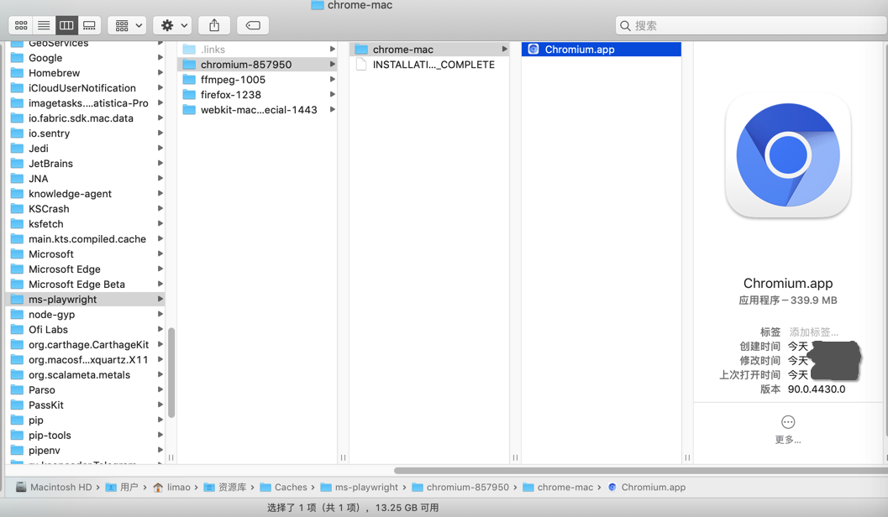
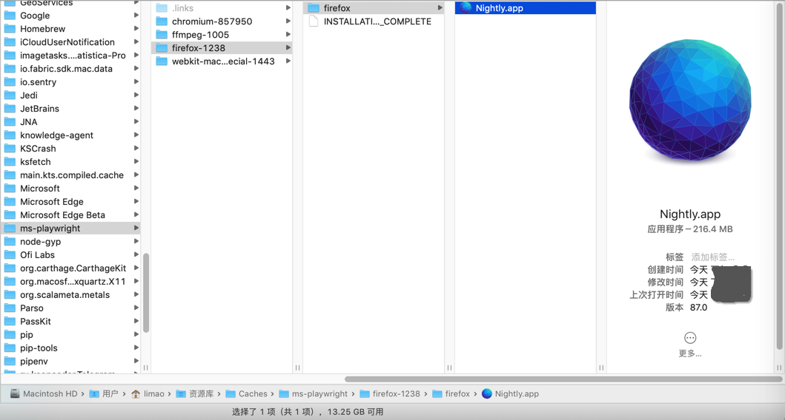
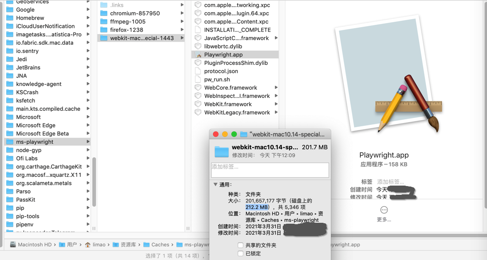
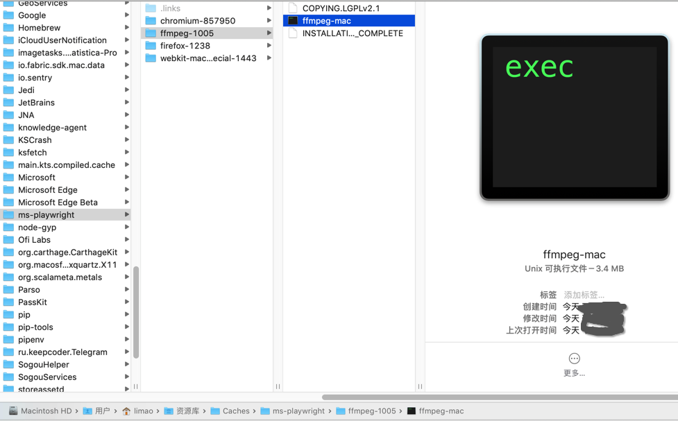
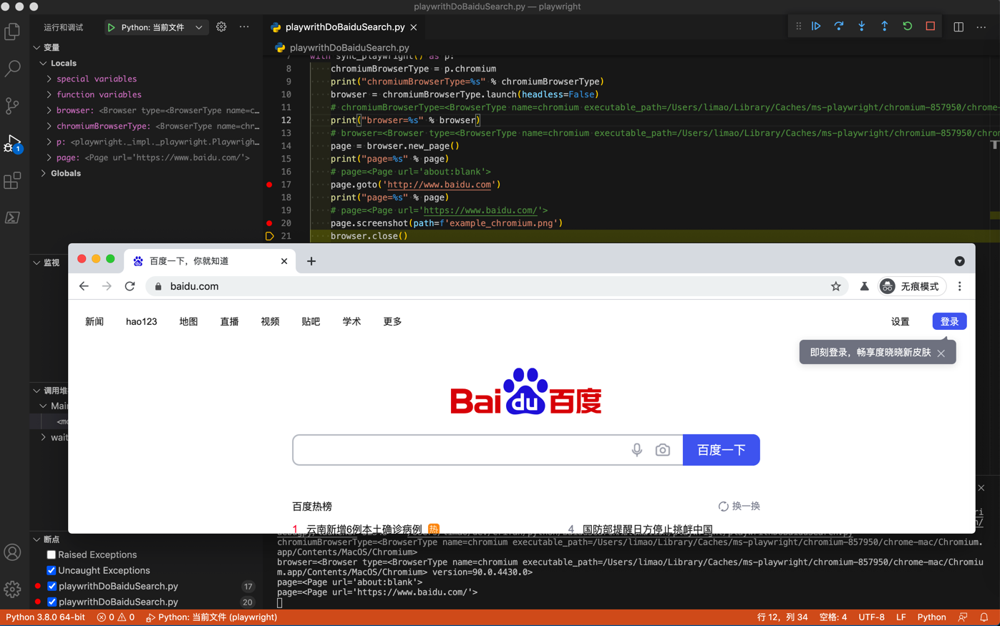

# 初始化环境

初始化Playwright开发环境

## Mac

### 安装playwright

```bash
pip install playwright
```

### 初始化安装web的driver

```bash
playwright install
```

或： `python -m playwright install`

注：安装浏览器驱动文件（安装过程稍微有点慢）

#### 详细日志

```bash
 playwright install
Downloading chromium v857950 - 113.9 Mb [====================] 100% 0.0s 
chromium v857950 downloaded to /Users/limao/Library/Caches/ms-playwright/chromium-857950
Downloading firefox v1238 - 75 Mb [====================] 100% 0.0s 
firefox v1238 downloaded to /Users/limao/Library/Caches/ms-playwright/firefox-1238
Downloading webkit v1443 - 52 Mb [====================] 100% 0.0s 
webkit v1443 downloaded to /Users/limao/Library/Caches/ms-playwright/webkit-mac10.14-special-1443
Downloading ffmpeg v1005 - 1.3 Mb [====================] 100% 0.0s 
ffmpeg v1005 downloaded to /Users/limao/Library/Caches/ms-playwright/ffmpeg-1005
```

此处下载安装了：
* chromium
  * 位置：`/Users/limao/Library/Caches/ms-playwright/chromium-857950`
  * 效果：
    * 
* firefox
  * 位置：`/Users/limao/Library/Caches/ms-playwright/firefox-1238`
  * 效果：
    * 
* webkit
  * 位置：`/Users/limao/Library/Caches/ms-playwright/webkit-mac10.14-special-1443`
  * 效果：
    * 
* ffmpeg
  * 位置：`/Users/limao/Library/Caches/ms-playwright/ffmpeg-1005`
  * 效果：
    * 

### 测试代码

```python
# Function: Playwright demo baidu search
# Author: Crifan Li
# Update: 20210331

from playwright.sync_api import sync_playwright

with sync_playwright() as p:
    chromiumBrowserType = p.chromium
    print("chromiumBrowserType=%s" % chromiumBrowserType)
    browser = chromiumBrowserType.launch(headless=False)
    # chromiumBrowserType=<BrowserType name=chromium executable_path=/Users/limao/Library/Caches/ms-playwright/chromium-857950/chrome-mac/Chromium.app/Contents/MacOS/Chromium>
    print("browser=%s" % browser)
    # browser=<Browser type=<BrowserType name=chromium executable_path=/Users/limao/Library/Caches/ms-playwright/chromium-857950/chrome-mac/Chromium.app/Contents/MacOS/Chromium> version=90.0.4430.0>
    page = browser.new_page()
    print("page=%s" % page)
    # page=<Page url='about:blank'>
    page.goto('http://www.baidu.com')
    print("page=%s" % page)
    # page=<Page url='https://www.baidu.com/'>
    page.screenshot(path=f'example_chromium.png')
    browser.close()
```

输出：

```bash
chromiumBrowserType=<BrowserType name=chromium executable_path=/Users/limao/Library/Caches/ms-playwright/chromium-857950/chrome-mac/Chromium.app/Contents/MacOS/Chromium>
browser=<Browser type=<BrowserType name=chromium executable_path=/Users/limao/Library/Caches/ms-playwright/chromium-857950/chrome-mac/Chromium.app/Contents/MacOS/Chromium> version=90.0.4430.0>
page=<Page url='about:blank'>
page=<Page url='https://www.baidu.com/'>
```

效果：




### 附带

#### 语法=帮助信息

```bash
 playwright --help        
Usage: npx playwright [options] [command]

Options:
  -V, --version                          output the version number
  -h, --help                             display help for command

Commands:
  open [options] [url]                   open page in browser specified via -b, --browser
  codegen [options] [url]                open page and generate code for user actions
  debug <app> [args...]                  run command in debug mode: disable timeout, open inspector
  install [browserType...]               ensure browsers necessary for this version of Playwright are installed
  install-deps [browserType...]          install dependencies necessary to run browsers (will ask for sudo permissions)
  cr [options] [url]                     open page in Chromium
  ff [options] [url]                     open page in Firefox
  wk [options] [url]                     open page in WebKit
  screenshot [options] <url> <filename>  capture a page screenshot
  pdf [options] <url> <filename>         save page as pdf
  help [command]                         display help for command
```
