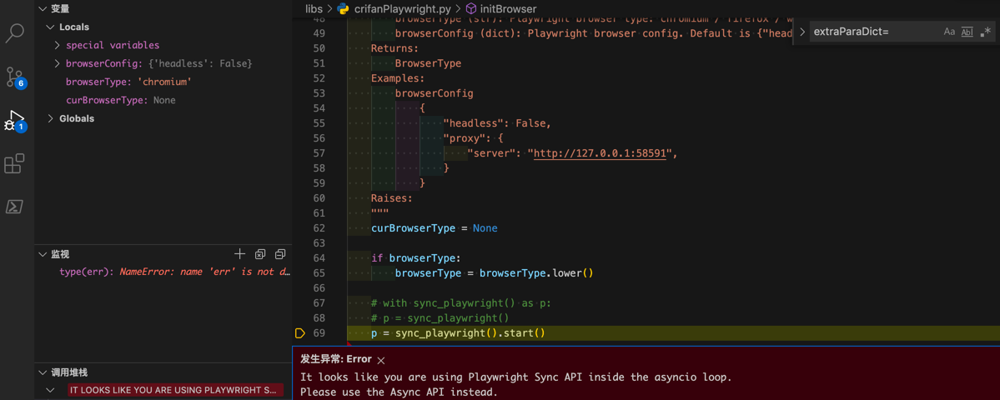

# using Playwright Sync API inside the asyncio loop

**背景**

正常写了，初始化Playwright的sync的api的代码后：

```python
def parseUrl(inputUrl, page=None):
    """Parse (redirected final long) url, title, html from input (possible short link) url

    Args:
        inputUrl (dict): input original (short link) url
        page (Page): Playwright page. Default is None. If None, create a new one.
    Returns:
        parse result(dict)
    Raises:
    """
    respValue = None

    if not page:
        page = initPage()

def initPage(pageConfig=None, browser=None):
    """Init playwright browser new page

    Args:
        pageConfig (dict): page config. Default is None.
        browser (BrowserType): Playwright browser. Default is None. If None, create new one
    Returns:
        Page
    Examples:
        pageConfig
            {"pageLoadTimeout": 10}
    Raises:
    """
    if not browser:
        browser = initBrowser()
。。。

def initBrowser(browserType="chromium", browserConfig={"headless": False}):
    """
    For playwright, init to create a browser. For later use, such as google search

    Args:
        browserType (str): Playwright browser type: chromium / firefox / webkit
        browserConfig (dict): Playwright browser config. Default is {"headless": False}.
    Returns:
        BrowserType
    Examples:
        browserConfig
            {
                "headless": False,
                "proxy": {
                    "server": "http://127.0.0.1:58591",
                }
            }
    Raises:
    """
    curBrowserType = None

    if browserType:
        browserType = browserType.lower()

    # with sync_playwright() as p:
    # p = sync_playwright()
    p = sync_playwright().start()
```

别处去调用，结果报错

```bash
发生异常: Error
It looks like you are using Playwright Sync API inside the asyncio loop. Please use the Async API instead.
```



以及：

后续类似代码：

```python
def testParseSpeed(parseFunc, shortLinkList, testRoundNum, configDict):
    for curRoundIdx in range(testRoundNum):
        curRoundResult = parseShorLink_Common(parseFunc, shortLinkList, configDict)
```

->

```python
def parseShorLink_Common(parseFunc, shortLinkList, configDict):
        browser = crifanPlaywright.initBrowser(browserConfig={"headless": isCurHeadless})
```

->

```python
def initBrowser(browserType="chromium", browserConfig={"headless": False}):
    p = sync_playwright().start()
```

又报同样错误。

**错误原因**：Playwright的内部实现机制，个人感觉，虽然看起来很高级，但是实际上用起来很是麻烦。导致，如果你是多次循环类的调用，或者是Python中的函数作为参数等情况，去初始化`browser`时，就会被内部判断为，视为，异步调用。

**解决办法**：只能把代码，改为，整套代码运行期间，**全局只能初始化一次**`browser`。

否则如果有多次初始化调用`sync_playwright().start()`就会报错。

比如我此处最后的代码是：

```python
    elif parseFunc == crifanPlaywright.parseUrl:
        # browser = extraParaDict["browser"]
        # browser = extracPara["browser"]
        # crifanPlaywright.closeBrowser(browser)
        pass
```

即：单轮测试之前，不去close这个Playwright的browser

```python
def testParseSpeed(parseFunc, shortLinkList, testRoundNum, configDict):
    global gDnsFailedHost


    extracPara = {}
    # workaround for: It looks like you are using Playwright Sync API inside the asyncio loop
    if parseFunc == crifanPlaywright.parseUrl:
        isCurHeadless = configDict["headless"]
        browser = crifanPlaywright.initBrowser(browserConfig={"headless": isCurHeadless})
        extracPara = {
            "browser": browser,
        }

。。。
    for curRoundIdx in range(testRoundNum):
。。。
        curRoundResult = parseShorLink_Common(parseFunc, shortLinkList, configDict, extracPara)
```

即：testParseSpeed中把browser的初始化，只运行一次

还要把全局的移动到最顶层：

```python
    extracPara = {}
    # workaround for: It looks like you are using Playwright Sync API inside the asyncio loop
    isCurHeadless = configDict["headless"]
    browser = crifanPlaywright.initBrowser(browserConfig={"headless": isCurHeadless})

    for eachParseFunc in parseFuncList:
        if eachParseFunc == crifanPlaywright.parseUrl:
            extracPara = {
                "browser": browser,
            }
        else:
            extracPara = {}

        testParseSpeed(eachParseFunc, shortLinkList, testRoundNum, configDict, extracPara)

。。。
def testParseSpeed(parseFunc, shortLinkList, testRoundNum, configDict, extracPara):

        curRoundResult = parseShorLink_Common(parseFunc, shortLinkList, configDict, extracPara)
```

最终才实现了：代码全局只能和确保只初始化一次`sync_playwright().start()`，才能规避此报错。。。

感慨：用起来很是垃圾，不好用啊
