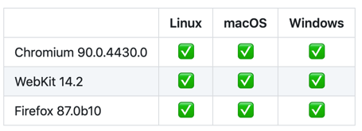

# Playwright概览

* `Playwright`
  * 一句话简介
    * 中文：微软开源的`Python`自动化神器`Playwright`
    * 英文：Node.js library to automate Chromium, Firefox and WebKit with a single API
  * 特点
    * 绿色环保ever-green
    * 能力强capable
    * 可靠性高reliable
    * 速度快fast
    * 跨平台==支持多个系统 + 支持多种浏览器（内核）
      * 
      * 跨平台
        * `Windows`
        * `MacOS`
        * `Linux`
      * 支持多种浏览器（内核）
        * `Chromium`
        * `Firefox`
        * `WebKit`
  * 说明
    * 微软新出的`Python`库，仅用一个API即可自动执行`Chromium`、`Firefox`、`WebKit`等主流浏览器自动化操作
    * 微软公司2020年初发布的新一代自动化测试工具，相较于目前最常用的Selenium，它仅用一个API即可自动执行Chromium、Firefox、WebKit等主流浏览器自动化操作。作为针对Python语言纯自动化的工具，在回归测试中可更快的实现自动化。
